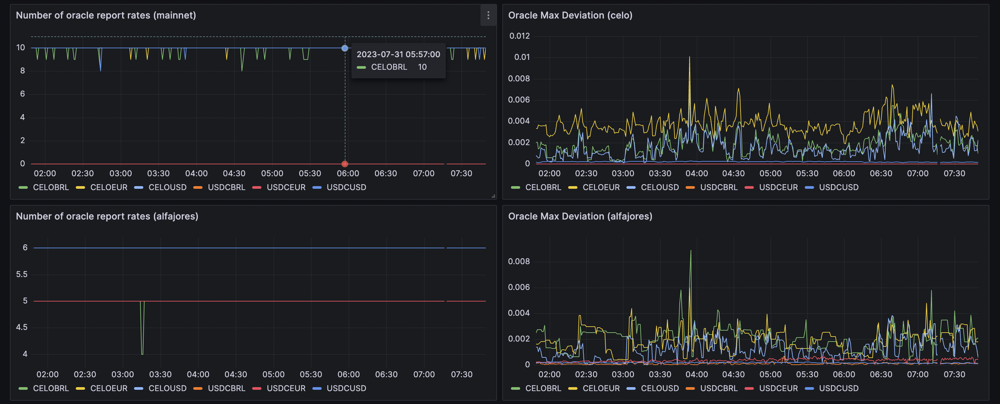

# Aegis

> The modern concept of doing something "under someone's aegis" means doing something under the protection of a powerful, knowledgeable, or benevolent source. The word Aegis is identified with protection by a strong force rooted in Greek mythology and adopted by the Romans.

Aegis is a monitoring tool that exposes the result of on-chain view calls as Prometheus metrics that get ingested into Grafana.
The system's ethos is that it should be generic and agnostic when it comes to business logic.

It allows you to turn a `config.yaml` like this:

```yaml
# config.yaml
source: SortedOracles.isOldestReportExpired(address rateFeed)(bool,address)
schedule: 0/10 * * * * *
type: gauge
chains: all
variants:
  - ['CELOUSD']
  - ['CELOEUR']
  - ['CELOBRL']
  - ['USDCUSD']
  - ['USDCEUR']
  - ['USDCBRL']
```

Into a Grafana Dashboard like this:



- [Running the app](#running-the-app)
- [Tests](#tests)
- [Deployment](#deployment)
  - [Deploying Aegis](#deploying-aegis)
  - [Deploying Grafana Resources](#deploying-grafana-resources)
  - [How to deploy a new rate feed](#how-to-deploy-a-new-rate-feed)
- [Checking the Logs](#checking-the-logs)
- [Configuration](#configuration)
  - [Global Config](#global-config)
  - [Chain-specific Config](#chain-specific-config)
  - [Metrics Config](#metrics-config)
    - [Full Metrics Example](#full-metrics-example)
  - [Adding a new Metric](#adding-a-new-metric)
- [Terraform for Grafana](#terraform-for-grafana)
  - [Set up Terraform](#set-up-terraform)
  - [Grafana Dashboard](#grafana-dashboard)
  - [Grafana Alerts](#grafana-alerts)

## Running the app

```bash
# install dependencies
pnpm install

# run a dev server
pnpm start

# run a dev server with hot reload
pnpm dev

# run in prod mode
pnpm run start:prod
```

## Tests

```bash
# unit tests
pnpm run test

# test coverage
pnpm run test:cov
```

## Deployment

### Deploying Aegis

There are three main components you have to think about:

1. The `aegis` service that polls view calls and exposes Prometheus metrics based on a `config.yaml` file.
2. A service that ingests the metrics, this could be:
   a. A `grafana-agent` instance which pushes the metrics to grafana-cloud.
   b. A Prometheus server that ingests the metrics.
3. (Optional) Helper smart contracts, which do any transformations needed to on-chain data for ingestion by `aegis.`

Deploying `aegis` is done by running

```sh
pnpm aegis:deploy
```

From inside `aegis/`, `pnpm deploy` is equivalent. The deploy script rebuilds
`dist/`, creates a temporary App Engine app root with the root pnpm lockfile's
Aegis importer, and uploads that staged service to `mento-monitoring`.

To deploy the `grafana-agent`, first seed the Grafana Cloud Secret Manager
versions in a fresh project, then follow the instructions in
[grafana-agent/README.md](./grafana-agent/README.md).

### Deploying Grafana Resources

Aegis Grafana dashboards and Aegis service-health alerts are managed in
`aegis/terraform`. Preview locally with:

```sh
pnpm aegis:tf:plan
```

Apply runs in CI on merge to main via
[`.github/workflows/aegis-terraform.yml`](../.github/workflows/aegis-terraform.yml),
gated by the `production` GitHub Environment required-reviewer rule.

Protocol alert rules and global Grafana notification routing live in
`alerts/rules` (`pnpm alerts:rules:plan`). See `docs/terraform.md` for the
stack registry.

### How to deploy a new rate feed

1. Update the [config.yaml](./config.yaml):
   - Add the new rate feed IDs and relayer signer wallets to `global.vars`
   - Add the new rate feeds as variants to the `SortedOracles.isOldestReportExpired()` metric
   - Add the new rate feeds as variants to the `BreakerBox.getRateFeedTradingMode()` metric
   - Add the new relayer signer as variants to the `CELOToken.balanceOf()` metric
1. [optional] If it's an FX rate feed with disabled trading on weekends because we don't get new price data on weekends:
   - Add the rate feed name to the `weekend_disabled_feeds` array in [alerts/rules/protocol-routing-locals.tf](../alerts/rules/protocol-routing-locals.tf)
1. Test the new config locally by running `pnpm start` and checking for any errors in the logs
1. After code review, deploy the new config via `pnpm aegis:deploy` (this rebuilds and stages the service before upload)
1. After successful deployment, check the logs for any errors via `pnpm aegis:logs`
1. Check that the new metrics appear in the Grafana Dashboard: `pnpm --filter @mento-protocol/aegis grafana`
   - New rate feeds should be picked up automatically, it might take a few minutes after they show up
1. Check that new [Oracle Relayer Grafana Alerts](https://clabsmento.grafana.net/alerting/list) have been added for the new Relayer Signer Wallets' CELO Balance after `alerts/rules` has been planned and applied.

## Checking the Logs

```bash
# Tails the logs of the prod aegis app
pnpm aegis:logs
```

## Configuration

The `config.yaml` has three immediate children:

```typescript
interface Config {
  global: Global; // Global definitions
  chains: Chain[]; // Chain definitions
  metrics: Metric[]; // Metric definitions
}
```

### Global Config

The `global` section hosts variables that can be referenced in the `metrics` section as arguments passed to view calls. Global variables can also be extended or overridden by `chain '-specific variables.

```typescript
interface Global {
  vars: Record<string, string>;
}
```

### Chain-specific Config

The `chain` section is an array of chain-specific settings:

```typescript
interface Chain {
  id: string;
  label: string;
  httpRpcUrl: string;
  contracts: Record<string, string>;
  vars: Record<string, string>;
}
```

- If the chain `id` matches an import from [viem's supported chains](https://github.com/wevm/viem/blob/main/src/chains/index.ts), we will use that import, enabling multicall and other goodness (for example, `celoSepolia` or `celo`).
  However, arbitrary values also work, and Aegis will create a custom chain instance in that case.
- `label` will be used for segmenting in the context of Prometheus metrics `chain={label}`.
- `contracts` should list addresses for all contracts referenced in `metrics`.
- `vars` can contain chain-specific variables to extend or override entries in the `global.vars` object.

### Metrics Config

`Metric` defines a metric with all its possible variations.

```typescript
interface Metric {
  source: string;
  schedule: string;
  type: 'gauge';
  chains: 'all' | string[];
  variants: string[][];
}
```

- The `source` for a metric is the view call used in string format of:

  ```sol
  Contract.function(inputType inputName)(outputType)
  ```

  For example:

  ```sol
  SortedOracles.isOldestReportExpired(address rateFeed)(bool,address)
  ```

  The contract name must be defined in the `chains[id].contracts` configs that the metric targets.

  The system currently supports various view call types, such as:
  - `SortedOracles.isOldestReportExpired(address rateFeed)(bool,address)`: A `bool` indicating whether the report on the given rate feed identifier has expired.
  - `BreakerBox.getRateFeedTradingMode(address rateFeed)(uint8)`: A single `uint8` indicating the trading mode of the given rate feed identifier.
  - `CELOToken.balanceOf(address owner)(uint256)`: A single `uint256` value, divided by 1e18 which must not exceed `Number.MAX_SAFE_INTEGER`.

  See the [Adding a new Metric section](#adding-a-new-metric) to learn how to add new view calls to Aegis.

- `schedule` is a cron schedule definition.
- `type` can currently be only `gauge`.
- `chains` can be `all` or an array of chain IDs to which this metric will apply.
- `variants` is a list where each item is an array of arguments passed to the view call.

#### Full Metrics Example

```yaml
source: SortedOracles.isOldestReportExpired(address rateFeed)(bool,address)
schedule: 0/10 * * * * *
type: gauge
chains: all
variants:
  - ['CELOUSD']
  - ['CELOEUR']
  - ['CELOBRL']
```

The `variants` are where the `vars` from the `global` and `chain` configs come into play.
Here, we're calling the function three times and, each time, passing the value of the variant variables as the `rateFeed` argument to the view call.

All arguments of the view call will also be passed as metric labels to Prometheus.
Thus, each metric will result in `number of variants * number of chains` values recorded.

An example of the Prometheus endpoint result:

```text
SortedOracles_isOldestReportExpired{rateFeed="CELOUSD",rateFeedValue="0x765de816845861e75a25fca122bb6898b8b1282a",chain="celo"} 0
SortedOracles_isOldestReportExpired{rateFeed="CELOEUR",rateFeedValue="0xd8763cba276a3738e6de85b4b3bf5fded6d6ca73",chain="celo"} 0
SortedOracles_isOldestReportExpired{rateFeed="CELOBRL",rateFeedValue="0xe8537a3d056da446677b9e9d6c5db704eaab4787",chain="celo"} 0
```

### Adding a new Metric

1. Add the contract you want to run a view call on to the `chains[id].contracts` section in `config.yaml` and make sure to add the correct address for each chain
1. Add your new view call to the bottom of the `metrics` section
   1. If your view call needs any input parameters, make sure to define these either in `global.vars` or `chains[id].vars`, and reference them as `variants` in your metric
1. Extend the `switch` statement in the [Metric.parse()](./src/metric.ts) function with the appropriate logic for your view call's contract & function name.
   1. If you already see another `case` for an existing view call using the same logic (i.e. another call returning a simple `uint256`), you can add the function name of your view call to that `case`
   1. If your view call requires new or adjusted logic, add a new `case` for your function name with the appropriate logic
1. Try out your changes locally by running `pnpm aegis:dev` and see if the logs output the values you expect
1. If everything works locally, deploy your changes via `pnpm aegis:deploy` (this rebuilds and stages the service before upload)
1. After successful deployment, check if everything works as expected by monitoring the logs via `pnpm aegis:logs`
1. Create a new Grafana visualization consuming your newly added metric
   1. If you're not a Grafana expert, the easiest would be to create a new empty dashboard and manually compose your query via the UI. You can also take inspiration from viewing the configuration of existing queries on other dashboards.
1. Export your new Grafana visualization to Terraform format
   1. After you're happy with your manually created query, it's time to convert it to Terraform so we can manage all our Grafana config as code and under version control. Your manually created query should offer an **Export** option somewhere on the top right.
   1. From there, it should have the option to export as `JSON`, `YAML`, or `Terraform (HCL)` — pick **Terraform (HCL)**
1. Add your export to [./terraform/grafana-dashboard/dashboard.tf](./terraform/grafana-dashboard/dashboard.tf) to the appropriate section
   1. Finding the right place can be a bit annoying as the exported config is quite verbose. AI is your friend here. You can copy/paste the existing `dashboard.tf` into your LLM of choice and then ask it to insert your newly exported visualization into the right place.
1. Open a PR with your changes. The Aegis Terraform workflow will plan against the new code and post a sticky comment with the diff. Review the plan, then merge to main — CI auto-applies (production gate enforces required-reviewer approval).
1. Ensure that it worked by reviewing the main Aegis dashboard in Grafana
1. If anything went wrong, roll back your changes to `dashboard.tf` and keep editing until you get it right :)

## Terraform for Grafana

We use Terraform to deploy the Aegis Grafana dashboard and Aegis service-health
alerts. Protocol alert rules and global notification routing are managed in
`alerts/rules`. The end-to-end Aegis flow is as follows:

1. The Aegis service executes view calls and forwards the results to Prometheus
1. Grafana ingests Prometheus metrics and allow us to visualize and react to them
1. Terraform deploys our metric visualizations into Grafana dashboards
1. Terraform also deploys the Aegis service-health alert rules based on these metrics

### Set up Terraform

1. Install Terraform

   ```sh
   # On macOS
   brew tap hashicorp/tap
   brew install hashicorp/tap/terraform

   # For other systems, see https://developer.hashicorp.com/terraform/install
   ```

1. Initialize Terraform

   ```sh
   cd terraform
   terraform init
   ```

1. Set up your local `terraform.tfvars` (think of it as `.env` for Terraform)

   ```sh
   # Create the file
   touch terraform/terraform.tfvars
   ```

   ```hcl
   ####################
   # terraform.tfvars #
   ####################

   # Grafana Cloud service account token for Aegis dashboards/service-health alerts.
   grafana_service_account_token =
   ```

   Slack/Splunk routing variables live in `alerts/rules/terraform.tfvars`.

1. Check that it's set up correctly

   ```sh
   # You must be inside the ./terraform folder for this command
   terraform plan
   ```

### Grafana Dashboard

```bash
# Opens the Aegis Grafana Dashboard in your default browser
pnpm --filter @mento-protocol/aegis grafana
```

We are using Terraform to deploy a Grafana Dashboard containing visualizations for all configured metrics.

To update the dashboard, make the desired changes in [./terraform/grafana-dashboard](./terraform/grafana-dashboard) and open a PR. CI plans against the change and posts a sticky comment; review, then merge to apply (production gate).

### Grafana Alerts

Aegis owns only the Aegis service-health rule group (`service=aegis`) in this
stack. Global contact points, Slack/Splunk routing, oracle-relayer
rules, reserve-balance rules, trading-mode rules, and trading-limit rules live
in `alerts/rules`.

To update Aegis service-health alert thresholds, edit
[`terraform/aegis-service-alerts.tf`](./terraform/aegis-service-alerts.tf) and
open a PR — CI plans and the production gate enforces review-before-apply.
To update protocol alerts or global routing, edit `../alerts/rules` and run
`pnpm alerts:rules:plan` (same auto-apply flow there).

Grafana uses the following concepts for managing alerts:

- [**Alert Rules**](https://grafana.com/docs/grafana/latest/alerting/fundamentals/alert-rules/): A set of evaluation criteria for when an alert should trigger
- [**Contact Points**](https://grafana.com/docs/grafana/latest/alerting/fundamentals/notifications/contact-points/): Alert channels like Slack, Splunk/VictorOps, Email etc.
- [**Notification Policies**](https://grafana.com/docs/grafana/latest/alerting/fundamentals/notifications/notification-policies/): Routing rules to determine which alerts get routed to what contact points.

#### Current Alerts

The protocol alert groups below are owned by `alerts/rules`, not by Aegis:

**Oracle Relayer Alerts** (`service=oracle-relayers`):

- Stale price feeds (oldest report expired)
- Low CELO balance for relayer wallets
- Routed to: Slack `#alerts-oracles`; page-severity alerts also route to `#alerts-critical` + VictorOps/Splunk.

**Reserve Balance Alerts** (`service=reserve`):

- Low reserve balances for CELO, USDC, USDT, EUROC
- Routed to: Slack `#alerts-reserve`

**Trading Mode Alerts** (`service=exchanges`):

- Trading halted (circuit breakers tripped)
- Routed to: Slack `#alerts-critical` + VictorOps/Splunk for prod page alerts; Slack `#alerts-testnet` for staging.

**Trading Limits Alerts** (`service=trading-limits`):

- **L0 Short-term Limits** (5-minute window): Alerts at 90% utilization → Slack `#alerts-pools`
- **L1 Medium-term Limits** (daily window): Alerts at 90% utilization → Slack `#alerts-critical` + VictorOps/Splunk
- **LG Global Lifetime Limits**: Alerts at 90% utilization → Slack `#alerts-critical` + VictorOps/Splunk
- Routed by severity through `alerts/rules`.

**Aegis Service Alerts** (`service=aegis`):

- Failed RPC calls
- Service not reporting new data
- Routed to: Slack `#alerts-infra`; page-severity alerts also route to `#alerts-critical` + VictorOps/Splunk.

### Terraform Troubleshooting

#### Terraform fails to delete Grafana Resources

At times, we've seen Terraform throw 409s when trying to delete old Grafana Resources (to replace them with new ones).

You have two choices when this happens:

1. Nuke everything via `terraform destroy` and re-deploy everything from a clean slate via `terraform apply`
2. OR try to manually delete the resources terraform is struggling with via the Grafana API. There is a little helper script that has some example API calls that you can use locally: [grafana-api-interactions.sh](./bin/grafana-api-interactions.sh)
