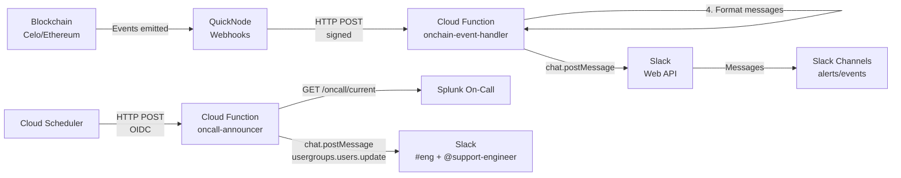

# Mento Alerts

Terraform-managed alert infrastructure for monitoring Mento's infrastructure across multiple blockchain networks.

## 📦 Module Structure

```plain
.
├── main.tf                 # Root configuration and module orchestration
├── variables.tf            # Shared variable definitions
├── outputs.tf              # Aggregated outputs
│
├── channels/
│   ├── sentry-bridge/      # Sentry JS error monitoring (Sentry → Slack bridge)
│   └── slack-channels/     # Slack channels for on-chain multisig events
├── onchain-event-listeners/ # QuickNode webhook management for on-chain events
├── oncall-announcer/        # Splunk On-Call rotation announcements to Slack
└── onchain-event-handler/   # Cloud Function for processing webhooks (TS + TF paired)
```

## 🏗️ Architecture

### Data Flow



### Component Overview

1. **QuickNode Webhooks**: Monitor blockchain events for configured multisig addresses
2. **Cloud Function**: Processes webhooks, verifies signatures, formats messages
3. **Slack Channels**: Receives formatted alerts and event notifications
4. **On-call Announcer**: Polls Splunk On-Call, posts rotations to `#eng`, and keeps `@support-engineer` membership to the current engineer
5. **Terraform**: Manages all infrastructure as code

### Security

- **Signature Verification**: All QuickNode webhooks are verified using HMAC-SHA256
- **Timestamp Validation**: Prevents replay attacks (5-minute window)
- **Payload Size Limits**: Maximum 10MB payload size
- **Secret Management**: Secrets stored in GCP Secret Manager

## Prerequisites

- **Terraform** >= 1.10.0
- **GCP account** with billing enabled
- **Slack bot** with channel-management, chat, usergroup membership, and email lookup scopes
- **Sentry account** (for JS error monitoring)
- **QuickNode account** (for blockchain monitoring)

## 🚀 Quick Start

### 1. Configure Variables

```bash
cp terraform.tfvars.example terraform.tfvars
```

Edit `terraform.tfvars`:

```hcl
# Sentry Configuration
sentry_auth_token             = "your-sentry-auth-token"
sentry_organization_slug      = "my-org"            # Optional, defaults to "mento-labs"
sentry_slack_workspace_name      = "Mento Labs"        # Optional, defaults to "Mento Labs"
sentry_slack_critical_channel    = "#alerts-critical"  # Optional, defaults to "#alerts-critical"
sentry_slack_critical_channel_id = "C0AURREPNDU"       # Optional, defaults to current "#alerts-critical" ID
# If rerouting critical fan-out, update both sentry_slack_critical_channel
# and sentry_slack_critical_channel_id together. Terraform rejects partial
# overrides, but cannot prove arbitrary custom name/ID pairs match.

# Slack Configuration (used by Terraform to create + archive Sentry and
# on-chain event channels, by Cloud Functions to post Slack messages, and by
# the on-call announcer to manage @support-engineer).
# Scopes required: channels:read, channels:manage, channels:join,
# channels:write.invites, chat:write, chat:write.public, usergroups:read,
# usergroups:write, users:read.email.
slack_bot_token = "xoxb-..."

# Splunk On-Call API credentials for the on-call announcer. A read-only key is
# sufficient. Leave both empty to keep the announcer disabled until the first
# credential bootstrap; setting both values enables the Cloud Function,
# scheduler, @support-engineer membership management, and GitHub secret sync.
splunk_on_call_api_id  = "your-splunk-on-call-api-id"
splunk_on_call_api_key = "your-splunk-on-call-api-key"

# Required when the announcer is enabled: Slack channel ID for #eng.
oncall_slack_channel_id = "C0123ABC456"

# Required when the announcer is enabled: Slack usergroup ID for
# @support-engineer. Create the usergroup in Slack once, then paste its ID here.
oncall_support_usergroup_id = "S0123ABC456"

# GCP Configuration
project_name     = "alerts"              # Optional, defaults to "alerts"
org_id           = "599540483579"
billing_account  = "XXXXXX-XXXXXX-XXXXXX"  # Required
region           = "europe-west1"        # Optional, defaults to "europe-west1"

# QuickNode Configuration
quicknode_api_key        = "your-quicknode-api-key"
quicknode_signing_secret = "your-signing-secret-at-least-32-chars"  # Generate: openssl rand -hex 32

# Multisig Configuration
multisigs = {
  "mento-labs-celo" = {
    name                   = "Mento Labs Multisig"
    address                = "0x655133d8E90F8190ed5c1F0f3710F602800C0150"
    chain                  = "celo"
    quicknode_network_name = "celo-mainnet"
  }
}

# Optional: Additional Labels
additional_labels = {
  environment = "production"
  team        = "platform"
  cost-center = "infrastructure"
}
```

### 2. Initialize & Deploy

```bash
terraform init
terraform plan
terraform apply
```

**Expected deployment time:** 5-10 minutes

### 3. Verify Deployment

```bash
terraform output
terraform state list
curl -X POST $(terraform output -raw cloud_function_url)  # Should return 401
```

## 📖 Usage Examples

### Single-Chain Setup

```hcl
multisigs = {
  "my-multisig" = {
    name                   = "My Multisig"
    address                = "0x1234567890123456789012345678901234567890"
    chain                  = "celo"
    quicknode_network_name = "celo-mainnet"
  }
}
```

### Multi-Chain Setup

The module automatically groups multisigs by chain and creates one QuickNode webhook per chain. A single Cloud Function handles webhooks from all chains.

```hcl
multisigs = {
  "mento-labs-celo" = {
    name                   = "Mento Labs Multisig"
    address                = "0x655133d8E90F8190ed5c1F0f3710F602800C0150"
    chain                  = "celo"
    quicknode_network_name = "celo-mainnet"
  }
  "mento-labs-ethereum" = {
    name                   = "Mento Labs Multisig"
    address                = "0x1234567890123456789012345678901234567890"
    chain                  = "ethereum"
    quicknode_network_name = "ethereum-mainnet"
  }
}
```

### Supported Chains

- **Celo**: `chain = "celo"`, `quicknode_network_name = "celo-mainnet"`
- **Ethereum**: `chain = "ethereum"`, `quicknode_network_name = "ethereum-mainnet"`

**Note:** `quicknode_network_name` must be a valid QuickNode network identifier. See QuickNode API documentation for the full list of supported networks.

## 📊 What Gets Created

### Sentry Module

- Two `sentry_alert` rules per Sentry project (auto-discovered):
  - Default alert → `#sentry-{project-slug}` Slack channel (issue lifecycle events).
  - Critical fan-out → `#alerts-critical` Slack channel (fatal first-seen/regression in production).
- One `restapi_object.sentry_slack_channel` per project — Terraform creates and archives the `#sentry-{project-slug}` channel via Slack's Web API.
- `#alerts-critical` is NOT created here (shared with Grafana page-grade alerts; managed externally).

### Slack On-Chain Monitoring Infrastructure

**Shared channels for all multisigs:**

- `#multisig-alerts` - Critical security events (owner/threshold/module changes)
- `#multisig-events` - Normal transaction events (executions, approvals, funds)

### Cloud Function

- Processes QuickNode webhooks from all chains
- Routes security events to alerts channel, operational events to events channel
- Validates webhook signatures
- All multisigs share the same two Slack channels

### On-call Announcer

- Runs from Cloud Scheduler every 15 minutes by default
- Polls Splunk On-Call `/api-public/v1/oncall/current`
- Resolves the current Splunk On-Call user email to a Slack user ID with `users.lookupByEmail`
- Posts one Slack message to `#eng` only when the on-call username changes
- Replaces `@support-engineer` membership with exactly that Slack user on every run
- Stores last-seen state in a private GCS bucket to suppress duplicate announcements
- Uses the configured `@support-engineer` Slack usergroup ID and replaces its
  membership with exactly the current on-call Slack user

### QuickNode Webhooks

- One webhook per chain
- Filters events by multisig addresses and event signatures
- Sends filtered events to Cloud Function

## 🔧 Common Operations

### Add New Multisig

Edit `terraform.tfvars`:

```hcl
multisigs = {
  "existing-name" = { ... },
  "new-multisig" = {
    name                   = "New Multisig Name"
    address                = "0xYourAddress..."
    chain                  = "celo"
    quicknode_network_name = "celo-mainnet"
  }
}
```

Then run `terraform apply`.

### View Logs

```bash
cd onchain-event-handler
./scripts/get-logs.sh
```

### Destroy Resources

```bash
terraform destroy -target=module.sentry_bridge  # Specific module
terraform destroy  # Everything
```

## 🐛 Troubleshooting

### Invalid Address Format

Addresses must:

- Start with `0x`
- Followed by exactly 40 hexadecimal characters
- Example: `0x655133d8E90F8190ed5c1F0f3710F602800C0150`

### Enable Debug Mode

Add to `terraform.tfvars`:

```hcl
debug_mode = true
```

This shows REST API requests/responses for troubleshooting.

## 📚 Documentation

### Module Documentation

- [`channels/sentry-bridge/README.md`](channels/sentry-bridge/README.md) - Sentry → Slack bridge module
- [`channels/slack-channels/README.md`](channels/slack-channels/README.md) - Slack channels for on-chain event notifications
- [`oncall-announcer/README.md`](oncall-announcer/README.md) - Splunk On-Call rotation announcer
- [`onchain-event-listeners/README.md`](onchain-event-listeners/README.md) - QuickNode webhook module for on-chain events
- [`onchain-event-handler/README.md`](onchain-event-handler/README.md) - Cloud Function module

### Code Quality

Follows [AWS Terraform best practices](https://docs.aws.amazon.com/prescriptive-guidance/latest/terraform-aws-provider-best-practices/structure.html) (adapted for GCP):

- Standard structure with data sources in dedicated `data.tf` files
- Consistent formatting (output descriptions, variable descriptions, naming conventions)
- Comprehensive labeling pattern using `merge()` for extensibility (GCP equivalent of AWS tags)
- Comprehensive README files for all modules with inline usage examples

### External Documentation

- [Terraform Documentation](https://developer.hashicorp.com/terraform/docs)
- [Sentry API Docs](https://docs.sentry.io/api/)
- [Slack API Docs](https://api.slack.com/web)
- [QuickNode Documentation](https://www.quicknode.com/docs)

## 🔒 Security

- API keys stored in `terraform.tfvars` (gitignored)
- Sensitive outputs marked appropriately
- State file contains secrets - handle carefully
- Webhook signatures validated for QuickNode requests

## 💰 Cost Estimate

~$5-20/month per chain (Cloud Function + Storage)

---

**Quick Commands Reference:**

```bash
# Initialization
terraform init
terraform plan
terraform apply

# Management
terraform output
terraform state list

# Updates
terraform plan
terraform apply

# Destruction
terraform destroy
```
