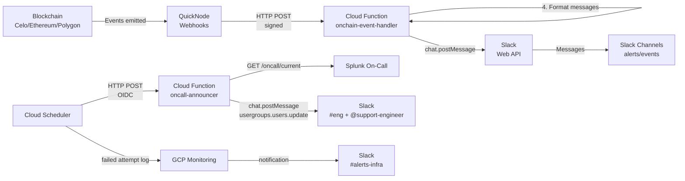

<!-- agent-context: title="Mento Alerts Delivery Infrastructure" status=active owner=eng canonical=true last_verified=2026-07-17 doc_type=runbook scope=alerts/infra review_interval_days=90 garden_lane=operator-runbooks -->

# Mento Alerts

Terraform-managed alert infrastructure for monitoring Mento's infrastructure across multiple blockchain networks.

## 📦 Module Structure

```plain
.
├── main.tf                 # Root configuration and module orchestration
├── variables.tf            # Shared variable definitions
├── outputs.tf              # Aggregated outputs
├── monitoring.tf           # GCP operational alerts → Slack #alerts-infra
│
├── channels/
│   ├── sentry-bridge/      # Sentry JS error monitoring (Sentry → Slack bridge)
│   └── slack-channels/     # Slack channels for on-chain multisig events
├── onchain-event-listeners/ # QuickNode webhook management for on-chain events
├── oncall-announcer/        # Splunk On-Call rotation announcements to Slack
└── onchain-event-handler/   # Cloud Function for processing webhooks (TS + TF paired)
```

## 🏗️ Architecture

### Data Flow



### Component Overview

1. **QuickNode Webhooks**: Monitor blockchain events for configured multisig addresses
2. **Cloud Function**: Processes webhooks, verifies signatures, formats messages
3. **Slack Channels**: Receives formatted alerts and event notifications
4. **On-call Announcer**: Polls Splunk On-Call, posts rotations to `#eng`, and keeps `@support-engineer` membership to the current engineer
5. **Operational Alerting**: Sends scheduler failures and dropped on-chain events to `#alerts-infra`
6. **Terraform**: Manages all infrastructure as code

### Security

- **Signature Verification**: All QuickNode webhooks are verified using HMAC-SHA256
- **Timestamp Validation**: Prevents replay attacks (5-minute window)
- **Payload Size Limits**: Maximum 10MB payload size
- **Secret Management**: Secrets stored in GCP Secret Manager

## Prerequisites

- **Terraform** >= 1.11.0
- **GCP account** with billing enabled
- **Slack bot** with channel-management, chat, usergroup membership, and email lookup scopes
- **Sentry account** (for JS error monitoring)
- **QuickNode account** (for blockchain monitoring)

## 🚀 Quick Start

### 1. Configure Variables

```bash
cp alerts/infra/terraform.tfvars.example alerts/infra/terraform.tfvars
```

Use [`terraform.tfvars.example`](terraform.tfvars.example) as the maintained
local variable guide. It documents the required GCP, Slack, Sentry, QuickNode,
and optional on-call values and their scope requirements.

Do not override `multisigs` in `terraform.tfvars` with a partial map: Terraform
would replace the entire committed default and silently stop monitoring omitted
Safes. Production multisig additions and removals belong in
[`variables.tf`](variables.tf), reviewed in a PR.

### 2. Initialize and plan

```bash
pnpm alerts:infra:init
pnpm alerts:infra:plan
```

Open a PR with the stack change and review the CI plan. Apply happens only after
merge to `main`, through `.github/workflows/alerts-infra.yml` and its
`production-infra` required-reviewer gate. Do not run a local Terraform apply.

### 3. Verify Deployment

```bash
terraform -chdir=alerts/infra output
FUNCTION_URL=$(terraform -chdir=alerts/infra output -json google_cloud | jq -r .cloud_function_url)
curl -X POST "$FUNCTION_URL"  # Should return 401 without a signed webhook payload.
```

## Supported chains

The stack groups multisigs by chain and creates one QuickNode webhook per
chain. One Cloud Function handles deliveries from all configured chains.

- **Celo**: `chain = "celo"`, `quicknode_network_name = "celo-mainnet"`
- **Ethereum**: `chain = "ethereum"`, `quicknode_network_name = "ethereum-mainnet"`
- **Polygon**: `chain = "polygon"`, `quicknode_network_name = "polygon-mainnet"`

The default production configuration monitors Polygon's `ReserveSafe`
(`0x8764…9aE1`) and `MigrationMultisig` (`0x5809…a458`) from
`@mento-protocol/contracts@0.9.0`. Safe Wallet links use the chain's canonical
EIP-3770 prefix (`celo`, `eth`, or `matic`) rather than the internal Terraform
chain key.

**Note:** `quicknode_network_name` must be a valid QuickNode network identifier. See QuickNode API documentation for the full list of supported networks.

## 📊 What Gets Created

### Sentry Module

- Two `sentry_alert` rules per Sentry project (auto-discovered):
  - Default alert → `#sentry-{project-slug}` Slack channel (issue lifecycle events).
  - Critical fan-out → `#alerts-critical` Slack channel (fatal first-seen/regression in production).
- One `restapi_object.sentry_slack_channel` per project — Terraform creates and archives the `#sentry-{project-slug}` channel via Slack's Web API.
- `#alerts-critical` is NOT created here (shared with Grafana page-grade alerts; managed externally).

### Slack On-Chain Monitoring Infrastructure

**Shared channels for all multisigs:**

- `#multisig-alerts` - Critical security events (owner/threshold/module changes)
- `#multisig-events` - Normal transaction events (executions, approvals, funds)

### Cloud Function

- Processes QuickNode webhooks from all chains
- Routes security events to alerts channel, operational events to events channel
- Validates webhook signatures
- All multisigs share the same two Slack channels

### On-call Announcer

- Runs from Cloud Scheduler every 15 minutes by default
- Polls Splunk On-Call `/api-public/v1/oncall/current`
- Resolves the current Splunk On-Call user email to a Slack user ID with `users.lookupByEmail`
- Posts one Slack message to `#eng` only when the on-call username changes
- Replaces the configured `@support-engineer` usergroup membership with exactly
  that Slack user on every run
- Stores last-seen state in a private GCS bucket to suppress duplicate announcements
- Alerts `#alerts-infra` when Cloud Scheduler reports a failed reconciliation
  attempt, including function 5xx responses, IAM failures, timeouts, and
  unreachable targets

### Operational Alerting

- Terraform creates the GCP Monitoring Slack notification channel for
  `#alerts-infra` with the existing bot token by default
- `slack_notification_channel_id` is an override for adopting an existing
  notification channel in the same GCP project
- On-call scheduler failures use a direct log-match policy, notify immediately,
  rate-limit repeat notifications to one per hour, and auto-close
  after 30 minutes without another matching failure
- On-chain handler drop and processing-budget policies share the same
  `#alerts-infra` destination

### QuickNode Webhooks

- One webhook per chain
- Filters events by multisig addresses and event signatures
- Sends filtered events to Cloud Function

## 🔧 Common Operations

### Add New Multisig

Edit the committed default in `alerts/infra/variables.tf` and open a PR:

```hcl
multisigs = {
  "existing-name" = { ... },
  "new-multisig" = {
    name                   = "New Multisig Name"
    address                = "0xYourAddress..."
    chain                  = "celo"
    quicknode_network_name = "celo-mainnet"
  }
}
```

Run `pnpm alerts:infra:plan`, review the webhook replacement, and let the
merged PR apply through the `production-infra` gate.

### View Logs

```bash
pnpm --filter @mento-protocol/alerts-onchain-event-handler logs
```

### Destroy Resources

Model removals in a PR and inspect `pnpm alerts:infra:plan`. Any destroy requires
explicit human approval and must run through the `production-infra`-gated CI
workflow. Never run an ad hoc local destroy of this stack.

## 🐛 Troubleshooting

### Invalid Address Format

Addresses must:

- Start with `0x`
- Followed by exactly 40 hexadecimal characters
- Example: `0x655133d8E90F8190ed5c1F0f3710F602800C0150`

### Enable Debug Mode

Add to `alerts/infra/terraform.tfvars`:

```hcl
debug_mode = true
```

This shows full REST API requests and responses, including the QuickNode API
key/signing secret and Slack bot token. Keep it false in CI, never share logs
captured with it enabled, and use it only for an explicitly scoped local
diagnostic session.

## 📚 Documentation

### Module Documentation

- [`channels/sentry-bridge/README.md`](channels/sentry-bridge/README.md) - Sentry → Slack bridge module
- [`channels/slack-channels/README.md`](channels/slack-channels/README.md) - Slack channels for on-chain event notifications
- [`oncall-announcer/README.md`](oncall-announcer/README.md) - Splunk On-Call rotation announcer
- [`onchain-event-listeners/README.md`](onchain-event-listeners/README.md) - QuickNode webhook module for on-chain events
- [`onchain-event-handler/README.md`](onchain-event-handler/README.md) - Cloud Function module

## 🔒 Security

- API keys stored in `terraform.tfvars` (gitignored)
- Sensitive outputs marked appropriately
- State file contains secrets - handle carefully
- Webhook signatures validated for QuickNode requests

**Quick Commands Reference:**

```bash
pnpm alerts:infra:init
pnpm alerts:infra:plan
pnpm alerts:handler:typecheck
pnpm alerts:handler:test
pnpm alerts:oncall:typecheck
pnpm alerts:oncall:test
# Apply and approved removals run only through production-infra-gated CI.
```
