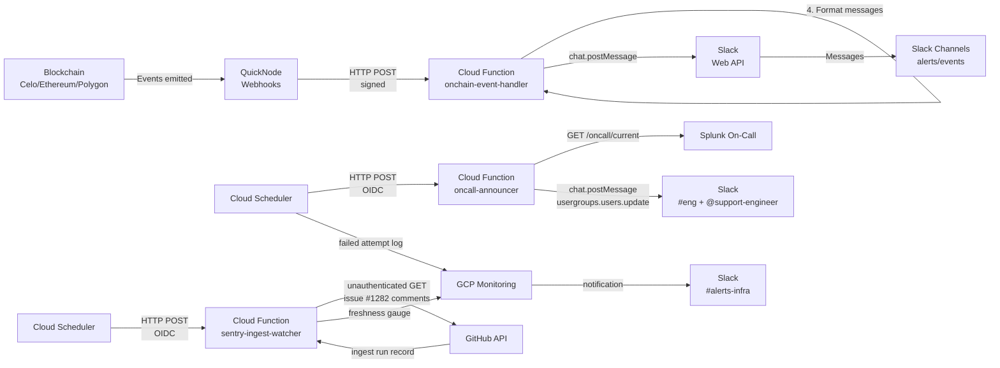

<!-- agent-context: title="Mento Alerts Delivery Infrastructure" status=active owner=eng canonical=true last_verified=2026-07-26 doc_type=runbook scope=alerts/infra review_interval_days=90 garden_lane=operator-runbooks -->

# Mento Alerts

Terraform-managed alert infrastructure for monitoring Mento's infrastructure across multiple blockchain networks.

## 📦 Module Structure

```plain
.
├── main.tf                 # Root configuration and module orchestration
├── variables.tf            # Shared variable definitions
├── outputs.tf              # Aggregated outputs
├── monitoring.tf           # GCP operational alerts → Slack #alerts-infra
│
├── channels/
│   ├── sentry-bridge/      # Sentry JS error monitoring (Sentry → Slack bridge)
│   └── slack-channels/     # Slack channels for on-chain multisig events
├── onchain-event-listeners/ # QuickNode webhook management for on-chain events
├── oncall-announcer/        # Splunk On-Call rotation announcements to Slack
├── onchain-event-handler/   # Cloud Function for processing webhooks (TS + TF paired)
└── sentry-ingest-watcher/   # Dead-man switch for the Sentry triage pipeline (ESM + TF paired)
```

## 🏗️ Architecture

### Data Flow


```mermaid
graph LR
    A[Blockchain<br/>Celo/Ethereum/Polygon] -->|Events emitted| B[QuickNode<br/>Webhooks]
    B -->|HTTP POST<br/>signed| C[Cloud Function<br/>onchain-event-handler]
    C -->|1. Verify signature| C
    C -->|2. Validate payload| C
    C -->|3. Process events| C
    C -->|4. Format messages| C
    C -->|chat.postMessage| D[Slack<br/>Web API]
    D -->|Messages| E[Slack Channels<br/>alerts/events]
    F[Cloud Scheduler] -->|HTTP POST<br/>OIDC| G[Cloud Function<br/>oncall-announcer]
    G -->|GET /oncall/current| H[Splunk On-Call]
    G -->|chat.postMessage<br/>usergroups.users.update| I[Slack<br/>#eng + @support-engineer]
    F -->|failed attempt log| J[GCP Monitoring]
    J -->|notification| K[Slack<br/>#alerts-infra]
    L[Cloud Scheduler] -->|HTTP POST<br/>OIDC| M[Cloud Function<br/>sentry-ingest-watcher]
    M -->|unauthenticated GET<br/>issue #1282 comments| N[GitHub API]
    N -->|ingest run record| M
    M -->|freshness gauge| J
```

### Component Overview

1. **QuickNode Webhooks**: Monitor blockchain events for configured multisig addresses
2. **Cloud Function**: Processes webhooks, verifies signatures, formats messages
3. **Slack Channels**: Receives formatted alerts and event notifications
4. **On-call Announcer**: Polls Splunk On-Call, posts rotations to `#eng`, and keeps `@support-engineer` membership to the current engineer
5. **Operational Alerting**: Sends scheduler failures and dropped on-chain events to `#alerts-infra`
6. **Sentry Ingest Watcher**: Publishes how long ago the Sentry triage ingest last recorded real work — read from the run record on tracker issue #1282, not from the workflow's conclusion — and alerts when that number gets too large or stops arriving
7. **Terraform**: Manages all infrastructure as code

### Security

- **Signature Verification**: All QuickNode webhooks are verified using HMAC-SHA256
- **Timestamp Validation**: Prevents replay attacks (5-minute window)
- **Payload Size Limits**: Maximum 10MB payload size
- **Secret Management**: Secrets stored in GCP Secret Manager

## Prerequisites

- **Terraform** >= 1.11.0
- **GCP account** with billing enabled
- **Slack bot** with channel-management, chat, usergroup membership, and email lookup scopes
- **Sentry account** (for JS error monitoring)
- **QuickNode account** (for blockchain monitoring)

## 🚀 Quick Start

### 1. Configure Variables

```bash
cp alerts/infra/terraform.tfvars.example alerts/infra/terraform.tfvars
```

Use [`terraform.tfvars.example`](terraform.tfvars.example) as the maintained
local variable guide. It documents the required GCP, Slack, Sentry, QuickNode,
and `@support-engineer` usergroup values, plus optional on-call-announcer
values and their scope requirements. Critical Peg pages require the usergroup
even when the optional announcer is disabled.

Do not override `multisigs` in `terraform.tfvars` with a partial map: Terraform
would replace the entire committed default and silently stop monitoring omitted
Safes. Production multisig additions and removals belong in
[`variables.tf`](variables.tf), reviewed in a PR.

### 2. Initialize and plan

```bash
pnpm alerts:infra:init
pnpm alerts:infra:plan
```

Open a PR with the stack change and review the CI plan. Apply normally happens
only after merge to `main`, through `.github/workflows/alerts-infra.yml` and
its `production-infra` required-reviewer gate.

### Recovering a missing `@support-engineer` workflow input

The protected `alerts-infra` workflow normally maintains the GitHub Actions
mirror for `TF_VAR_ONCALL_SUPPORT_USERGROUP_ID`. If the mirror's name is
missing, the workflow cannot restore it: the same value is required before
Terraform can reach the mirror resource. Confirm that only the name is missing
without reading its value. Then, after explicit human approval, use clean
current `main` and the existing gitignored `alerts/infra/terraform.tfvars` to
review and apply the `alerts-delivery` stack locally:

```bash
pnpm tf plan alerts-delivery
pnpm tf apply alerts-delivery
```

Inspect the plan, monitor the apply to completion, verify the mirror name, and
then run the next trusted-main or drift plan. Never use a GitHub secret CLI to
seed or restore this input.

### 3. Verify Deployment

```bash
terraform -chdir=alerts/infra output
FUNCTION_URL=$(terraform -chdir=alerts/infra output -json google_cloud | jq -r .cloud_function_url)
curl -X POST "$FUNCTION_URL"  # Should return 401 without a signed webhook payload.
```

## Supported chains

The stack groups multisigs by chain and creates one QuickNode webhook per
chain. One Cloud Function handles deliveries from all configured chains.

- **Celo**: `chain = "celo"`, `quicknode_network_name = "celo-mainnet"`
- **Ethereum**: `chain = "ethereum"`, `quicknode_network_name = "ethereum-mainnet"`
- **Polygon**: `chain = "polygon"`, `quicknode_network_name = "polygon-mainnet"`

The default production configuration monitors Polygon's `ReserveSafe`
(`0x8764…9aE1`) and `MigrationMultisig` (`0x5809…a458`) from
`@mento-protocol/contracts@0.9.0`. Safe Wallet links use the chain's canonical
EIP-3770 prefix (`celo`, `eth`, or `matic`) rather than the internal Terraform
chain key.

**Note:** `quicknode_network_name` must be a valid QuickNode network identifier. See QuickNode API documentation for the full list of supported networks.

## 📊 What Gets Created

### Sentry Module

- Pins `jianyuan/sentry@0.15.4` in both Terraform constraints and the
  alerts-delivery lockfile. The scoped
  [`sentry-bridge` runbook](channels/sentry-bridge/README.md) records the
  upstream behavior audit and channel-name normalization invariant.
- Two `sentry_alert` rules per Sentry project (auto-discovered):
  - Default alert → `#sentry-{project-slug}` Slack channel (issue lifecycle events).
  - Critical fan-out → `#alerts-critical` Slack channel (fatal first-seen/regression in production).
- One `restapi_object.sentry_slack_channel` per project — Terraform creates and archives the `#sentry-{project-slug}` channel via Slack's Web API.
- `#alerts-critical` is NOT created here (shared with Grafana page-grade alerts; managed externally).

### Slack On-Chain Monitoring Infrastructure

**Shared channels for all multisigs:**

- `#multisig-alerts` - Critical security events (owner/threshold/module changes)
- `#multisig-events` - Normal transaction events (executions, approvals, funds)

### Cloud Function

- Processes QuickNode webhooks from all chains
- Routes security events to alerts channel, operational events to events channel
- Validates webhook signatures
- All multisigs share the same two Slack channels

### On-call Announcer

- Runs from Cloud Scheduler every 15 minutes by default
- Polls Splunk On-Call `/api-public/v1/oncall/current`
- Resolves the current Splunk On-Call user email to a Slack user ID with `users.lookupByEmail`
- Posts one Slack message to `#eng` only when the on-call username changes
- Replaces the configured `@support-engineer` usergroup membership with exactly
  that Slack user on every run
- Stores last-seen state in a private GCS bucket to suppress duplicate announcements
- Alerts `#alerts-infra` when Cloud Scheduler reports a failed reconciliation
  attempt, including function 5xx responses, IAM failures, timeouts, and
  unreachable targets

### Sentry Ingest Watcher

Dead-man switch for the Sentry triage pipeline (issue #1281, ADR 0036). It
exists because a self-report from a dead scheduler never arrives — a previous
cloud-routine experiment ran for weeks producing nothing and nobody noticed.

- Cloud Scheduler calls the `sentry-ingest-watcher` Cloud Function hourly,
  entirely outside GitHub Actions
- The health signal is the rolling ingest **run record** on tracker issue
  #1282, not the workflow conclusion. `sentry-triage-ingest.yml` concludes
  `success` when the kill switch is off or `SENTRY_TRIAGE_TOKEN` is missing,
  and both paths return before the record is written. The record therefore
  proves work happened, where a green run proves only exit code 0
- Freshness comes from the ISO timestamp **inside the record body**, which the
  ingest writes after its loop finishes. Never from the comment's `created_at`
  or `updated_at`: those move on any edit to the comment object, so a metadata
  mutation would drive the gauge fresh over a dead pipeline
- The record is fenced on author (`github-actions[bot]` / `github-actions`) and
  on the marker appearing at the **start** of the body. #1282 is public, so
  without both fences a drive-by comment could hold the gauge green. Same
  discipline as the writers in #1708
- The read is **unauthenticated**. The repository is public and the endpoint
  needs no scope, so one call per hour stays far inside the 60/hr anonymous
  limit. **Do not add a token** — a watcher holding a credential is a
  credential on a service whose only job is to notice silence
- It publishes that age as
  `custom.googleapis.com/sentry_triage/ingest_freshness_seconds` (GAUGE, INT64,
  `global` resource). Its runtime identity holds exactly one permission,
  `roles/monitoring.metricWriter`
- When GitHub is unreachable, no trusted record exists, or the timestamp cannot
  be read, the function publishes **nothing** and returns 5xx. Guessing a value
  would look fresh; silence is the honest signal
- The watcher pins the marker version `run-record:v1`. A `v2` bump that lands
  without updating the watcher makes it fail closed and alert — deliberate, so
  the contract cannot drift silently. `RUN_RECORD_MARKER` in
  `scripts/sentry-triage-ingest.mjs` carries the matching note
- `sentry-triage-ingest-stale` alerts `#alerts-infra` on two conditions that
  divide cleanly. A threshold condition owns _ingest is stale and the watcher
  is still reporting_: the gauge exceeds 26h (ingest runs 2x/day and GitHub's
  scheduler drifts up to ~3h, so 26h clears normal drift). An absence
  condition owns _nothing is reporting at all_: no point for 3h. The absence
  half is the dead-man switch — a watcher that can fail quietly reproduces the
  incident it exists to prevent
- **Real absence latency is 5h, not the 3h `duration` reads.** Both conditions
  aggregate over a 7200s `ALIGN_MAX` window, and an aligned point persists
  while that trailing window still holds the last raw publish, so the absence
  timer starts 2h late
- That 5h is measured **from the last published point**, not from the moment
  the watcher stops, and the two differ by up to the publish interval. A
  watcher dying just after a publish is caught ~5h later; one dying just
  before the next is caught ~4h later. The missed run is already inside the
  window, so it is not added on top
- It is **watcher-silence** latency, not pipeline-death latency. Ingest dying
  while the watcher keeps reporting is the threshold condition's job, and that
  one fires at 26h
- The threshold deliberately does not set `evaluation_missing_data`. Freshness
  is an absolute age rather than a delta, so a gap loses no information: the
  first point after any gap carries the true age and crosses 26h on its own if
  the pipeline is really dead. Treating the gap itself as a violation would
  only add firing while the watcher blips and the pipeline is fine. The v3 API
  forbids the combination regardless — that control requires
  `duration >= 60s`, and this condition runs at `0s` so a single aligned point
  over 26h alerts immediately
- The pure helpers are unit-tested with `pnpm alerts:watcher:test`. The
  function's own code imports nothing beyond them; `package.json` pins only
  the Cloud Functions runtime shim, at the exact version the other two
  functions run, so there is no package-local lockfile to keep in sync

Ingest is the only stage watched. The triage-agent, autofix, and archive legs
legitimately no-op for days when the queue is empty, so alerting on their
silence would be noise. Ingest runs every day regardless of queue state, which
is what makes its silence unambiguous.

#### After apply: prove the switch fires

Cloud Monitoring cannot alert on a time series that has never existed, so all
three steps below are required before treating this as armed. They prove the
two conditions separately: step 2 covers the threshold, step 3 covers absence.

1. Confirm the first publish, and that the value it published is the real run
   record. Run the scheduler job once, then compare the logged
   `lastIngestRunAt` with the timestamp in the record comment on #1282 — they
   must match. A publish alone only proves the function ran; matching
   timestamps prove it read the right signal.

   ```bash
   PROJECT_ID=$(terraform -chdir=alerts/infra output -json sentry_ingest_watcher | jq -r .function_logs | sed 's/.*project=//')
   gcloud scheduler jobs run sentry-ingest-freshness-check \
     --location europe-west1 --project "$PROJECT_ID"
   gcloud logging read \
     'jsonPayload.message="sentry_ingest_watcher.published"' \
     --project "$PROJECT_ID" --limit 1 --freshness 10m \
     --format='value(jsonPayload.lastIngestRunAt, jsonPayload.freshnessSeconds)'

   # The record this must agree with:
   gh api repos/mento-protocol/monitoring-monorepo/issues/1282/comments \
     --jq '.[] | select(.user.login == "github-actions[bot]")
                | select(.body | startswith("<!-- sentry-triage-ingest:run-record:v1 -->"))
                | .body' | head -3
   ```

2. Prove the alert path with a deliberately stale value. Write one point at 48h
   — past the 26h threshold — and wait for the `#alerts-infra` message. Nothing
   in Terraform changes, and the next hourly run overwrites the gauge with the
   real value:

   ```bash
   curl -sS -X POST \
     -H "Authorization: Bearer $(gcloud auth print-access-token)" \
     -H "Content-Type: application/json" \
     "https://monitoring.googleapis.com/v3/projects/$PROJECT_ID/timeSeries" \
     -d "{\"timeSeries\":[{\"metric\":{\"type\":\"custom.googleapis.com/sentry_triage/ingest_freshness_seconds\"},\"resource\":{\"type\":\"global\",\"labels\":{\"project_id\":\"$PROJECT_ID\"}},\"points\":[{\"interval\":{\"endTime\":\"$(date -u +%Y-%m-%dT%H:%M:%SZ)\"},\"value\":{\"int64Value\":\"172800\"}}]}]}"
   ```

   The threshold condition runs at `duration = "0s"` and the policy aligns on
   7200s windows, so allow up to two hours for the incident to open.

3. Prove the absence condition, which is the dead-man half and the one this
   whole alert exists for. Step 2 does not exercise it: a stale value is still
   a value. The threshold cannot cover a watcher that stops publishing, so
   this is the only step that proves the switch survives its own death.

   Pause the scheduler and leave it paused **more than 5h**. The absence
   condition carries the same 7200s `ALIGN_MAX` aggregation as the threshold,
   and an aligned point keeps existing while a trailing 2h window still
   contains the last raw publish. So the 3h `duration` timer cannot start until
   2h after the final point:

   ```text
   last publish + 7200s (alignment empties) + 10800s (duration) = fire
   ```

   Expect the alert about 5h after the last publish, plus a couple of minutes
   of propagation. **At the 3h mark it has not fired yet, and reading
   `duration = "10800s"` as the wait is what makes an operator conclude the
   switch is broken.**

   **Resume it afterwards** — a paused watcher is a disarmed switch:

   ```bash
   gcloud scheduler jobs pause sentry-ingest-freshness-check \
     --location europe-west1 --project "$PROJECT_ID"
   # wait > 5h (2h alignment + 3h duration), confirm the alert fires, then:
   gcloud scheduler jobs resume sentry-ingest-freshness-check \
     --location europe-west1 --project "$PROJECT_ID"
   # verify it took: state must read ENABLED
   gcloud scheduler jobs describe sentry-ingest-freshness-check \
     --location europe-west1 --project "$PROJECT_ID" --format='value(state)'
   ```

   The absence message is distinguishable from the threshold's and worth
   checking rather than assuming: it says _"has not been seen for over 180
   minutes"_ and carries **no value**, because there is no data point to
   report. A message quoting a value is the threshold condition, not this one.

Do not sign this off on a passing plan alone — an untested dead-man switch is
the failure mode being guarded against.

### Operational Alerting

- Terraform creates the GCP Monitoring Slack notification channel for
  `#alerts-infra` with the existing bot token by default
- `slack_notification_channel_id` is an override for adopting an existing
  notification channel in the same GCP project
- On-call scheduler failures use a direct log-match policy, notify immediately,
  rate-limit repeat notifications to one per hour, and auto-close
  after 30 minutes without another matching failure
- On-chain handler drop and processing-budget policies share the same
  `#alerts-infra` destination
- `sentry-triage-ingest-stale` shares that destination too, and is the only
  policy here that alerts on an absent series rather than on a signal it
  received

### Build-artifact retention

Every Gen2 deploy leaves two kinds of debris. One is bounded here, one is a
known gap.

**Function source zips — partly bounded.** Versioning keeps each replaced
archive as a noncurrent generation forever, so a source bucket needs a Delete
rule at `days_since_noncurrent_time = 30`. Expire by noncurrent age, never by
`num_newer_versions`: the object name embeds the source hash, so no generation
ever gains newer versions under its own name and a count condition would never
fire. The live archive is never ARCHIVED and always survives.

Only `sentry-ingest-watcher` carries this rule. **`onchain-event-handler` and
`oncall-announcer` still have no expiry rule**, so their noncurrent archives
accumulate without limit. Both are cheap to fix — the same `lifecycle_rule`
block, on a bucket that already exists.

**Build images — not bounded.** `gcf-artifacts` holds the function and build
cache images for all three Gen2 functions in this project. It was created by
Cloud Functions on 2025-11-17 and has **no cleanup policy at all**, so every
redeploy by every function adds versions that are never collected.
`governance-watchdog/infra/artifact-registry.tf` solved the same problem there
(delete older than 30 days, keep the 3 most recent per package) and is the
model to copy.

Adopting it here needs more than a resource block. The repository already
exists, so Terraform must `import` it before the first apply — and
`.github/workflows/alerts-infra.yml` applies unattended on merge with
`terraform init` then `terraform apply` and nothing in between. A resource that
adopts existing infrastructure would fail that apply with "already exists" and
block every other change in the stack. The adoption therefore needs a matching
change to the gated apply workflow, and belongs in its own PR.

### QuickNode Webhooks

- One webhook per chain
- Filters events by multisig addresses and event signatures
- Sends filtered events to Cloud Function

## 🔧 Common Operations

### Add New Multisig

Edit the committed default in `alerts/infra/variables.tf` and open a PR:

```hcl
multisigs = {
  "existing-name" = { ... },
  "new-multisig" = {
    name                   = "New Multisig Name"
    address                = "0xYourAddress..."
    chain                  = "celo"
    quicknode_network_name = "celo-mainnet"
  }
}
```

Run `pnpm alerts:infra:plan`, review the webhook replacement, and let the
merged PR apply through the `production-infra` gate.

### View Logs

```bash
pnpm --filter @mento-protocol/alerts-onchain-event-handler logs
```

### Destroy Resources

Model removals in a PR and inspect `pnpm alerts:infra:plan`. Any destroy requires
explicit human approval and must run through the `production-infra`-gated CI
workflow. Never run an ad hoc local destroy of this stack.

## 🐛 Troubleshooting

### Invalid Address Format

Addresses must:

- Start with `0x`
- Followed by exactly 40 hexadecimal characters
- Example: `0x655133d8E90F8190ed5c1F0f3710F602800C0150`

### Enable Debug Mode

Add to `alerts/infra/terraform.tfvars`:

```hcl
debug_mode = true
```

This shows full REST API requests and responses, including the QuickNode API
key/signing secret and Slack bot token. Keep it false in CI, never share logs
captured with it enabled, and use it only for an explicitly scoped local
diagnostic session.

## 📚 Documentation

### Module Documentation

- [`channels/sentry-bridge/README.md`](channels/sentry-bridge/README.md) - Sentry → Slack bridge module
- [`channels/slack-channels/README.md`](channels/slack-channels/README.md) - Slack channels for on-chain event notifications
- [`oncall-announcer/README.md`](oncall-announcer/README.md) - Splunk On-Call rotation announcer
- [`onchain-event-listeners/README.md`](onchain-event-listeners/README.md) - QuickNode webhook module for on-chain events
- [`onchain-event-handler/README.md`](onchain-event-handler/README.md) - Cloud Function module

## 🔒 Security

- API keys stored in `terraform.tfvars` (gitignored)
- Sensitive outputs marked appropriately
- State file contains secrets - handle carefully
- Webhook signatures validated for QuickNode requests

**Quick Commands Reference:**

```bash
pnpm alerts:infra:init
pnpm alerts:infra:plan
pnpm alerts:handler:typecheck
pnpm alerts:handler:test
pnpm alerts:oncall:typecheck
pnpm alerts:oncall:test
# Apply and approved removals run only through production-infra-gated CI.
```
