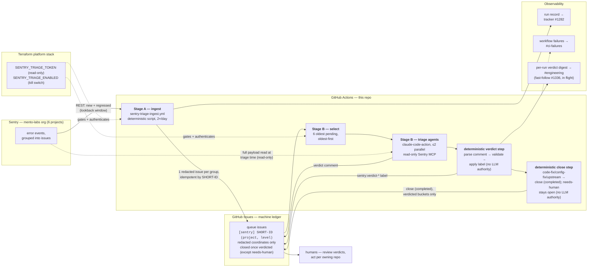
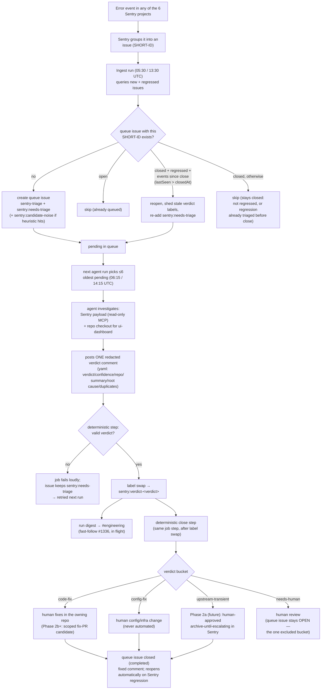

# Sentry triage pipeline

Operational reference for the staged Sentry issue triage/autofix pipeline
decided in [ADR 0036](../adr/0036-sentry-triage-pipeline.md). This note is
intentionally sectioned by pipeline stage: each stage's issue lands its own
section here so later stages (phased mutations, the push leg) extend this file
instead of rewriting it. Phase 1 = Stage A (deterministic ingest) + Stage B
(read-only triage verdicts).

## How it fits together

The life of a Sentry issue, in one paragraph: an error event lands in one of
the org's six Sentry projects; twice a day the deterministic ingest turns every
new or regressed issue group into one redacted queue issue in this repo; 45
minutes later the triage agent picks the oldest pending batch, investigates
each via read-only Sentry access, and posts a structured verdict; a
deterministic workflow step validates the verdict, applies the matching label,
and — for every bucket except `needs-human` — closes the queue issue (state
reason: completed) with a fixed closing comment, so the queue reads as
work-in-flight instead of a growing archive; humans consume verdicts by
label — nothing is fixed, archived, or resolved **in Sentry** automatically in
Phase 1; closing only ever touches this repo's local ledger issue, and a
closed queue issue reopens automatically (Stage A's regression-reopen path)
once the underlying Sentry issue records events newer than the close.

### Architecture



### Process flow — life of one Sentry issue



Nothing in Phase 1 mutates Sentry or any codebase: the only writes anywhere
are the queue issue (create/reopen/close), the verdict comment, the label, and
the notifications. Closing a queue issue never touches Sentry — the underlying
Sentry issue keeps whatever status it already had; only the local ledger entry
closes.

## Queue contract (v2)

Stage A (`scripts/sentry-triage-ingest.mjs`, `.github/workflows/sentry-triage-ingest.yml`)
turns every new or regressed Sentry issue across the `mento-labs` org into
exactly one GitHub queue issue in this repo. The contract below is normative —
Stage B (the read-only triage agent) and later phases build against it. Do not
change it without updating the ingest script and this doc together.

**v2 privacy rule (why this contract looks the way it does):** this repo is
PUBLIC, so raw Sentry payload text — issue titles, culprits, messages — would
publish production error data (ADR 0036). No payload-derived text may appear
anywhere in a queue issue: not in the title, not in the yaml block, not in
the human-readable section, not in comments. Queue issues carry only
Sentry-assigned identifiers, counters, and timestamps; triage reads the
actual payload in Sentry via the permalink. The raw title is still used
IN-MEMORY for noise classification — only the resulting label is public.

### Source

- Sentry org `mento-labs` (SaaS, region `https://us.sentry.io`), 6 projects
  across 4 repos: `analytics-mento-org`, `analytics-api`, `app-mento-org`,
  `governance-mento-org`, `minipay-dapp`, `reserve-mento-org`. Every project's
  issues funnel into this repo's queue via one org-wide endpoint — fix PRs in
  the owning repo are a later phase, not part of Stage A.
- `GET https://us.sentry.io/api/0/organizations/mento-labs/issues/`, paginated
  via `Link` response headers.
  - New issues: `query=is:unresolved firstSeen:-<N>d` — the lookback `<N>`
    defaults to 8 days and is configurable (integer 1-90) via the
    `SENTRY_TRIAGE_LOOKBACK_DAYS` env var, the `--lookback-days` CLI flag
    (flag wins), or the workflow's `lookback_days` dispatch input.
  - Regressed issues: `query=is:unresolved is:regressed`
- `Authorization: Bearer $SENTRY_TRIAGE_TOKEN` (read-only token; Stage A never
  writes to Sentry).

### Title

```text
[sentry] <SHORT-ID> (<project>, <level>)
```

Example: `[sentry] GOVERNANCE-MENTO-ORG-51 (governance-mento-org, error)`

`<SHORT-ID>` is the Sentry issue's own `shortId` (e.g.
`GOVERNANCE-MENTO-ORG-51`). The Sentry issue title is payload text and never
appears here (v2 privacy rule). The queue title is the sole idempotency key —
see below.

### Idempotency

Before creating an issue, search existing queue issues (**all states**) for a
title whose first whitespace-delimited token after the `[sentry]` prefix
equals `<SHORT-ID>`:

- **Open match** → skip.
- **Closed match, Sentry issue is regressed, and its `lastSeen` is strictly
  newer than the queue issue's `closed_at`** → reopen it, comment
  `Regressed in Sentry (last seen <ts>)`, re-add `sentry:needs-triage`, and
  remove any stale `sentry:verdict-*` labels — the old verdict described the
  old occurrence, and a reopened issue must read as awaiting triage, not as
  carrying a verdict and needs-triage at once. The timestamp gate exists
  because Sentry keeps `substatus=regressed` for days after a regression:
  without it, a verdict-closed stub would loop reopen → re-triage → close on
  every ingest run until Sentry flips the substatus. Missing or unparsable
  timestamps fail open toward triage (reopen) — a wrongly skipped regression
  is silent, a wrongly reopened one merely re-triages.
- **Closed match, otherwise** → skip (stays closed): not regressed, or a
  regression whose events all predate the close and were therefore already
  triaged before the ledger entry closed.
- **No match** → create.

At ~31 new issue groups/week org-wide, the ingest script does this as one
bulk scan per run (not one search per issue): it pages through the complete
`sentry-triage` label set, all states, with no result cap — a capped scan
would silently start duplicating older regressed issues once the queue
outgrows the cap.

**Queue hygiene counterpart:** the deterministic close step (verdict contract
below) closes verdicted queue issues so the tracker stays readable. To this
scan, a queue issue closed by the verdict-close step is just another "closed
match" — and the `lastSeen`-vs-`closed_at` gate above is what makes the
pairing loop-free: a regression with events newer than the close reopens for
re-triage, while Sentry's days-long `substatus=regressed` tail on an
already-triaged occurrence leaves the ledger entry closed.

### Labels

Every queue issue carries `sentry-triage` (the durable queue-namespace
marker, kept for the issue's lifetime) plus `sentry:needs-triage`.
`sentry:candidate-noise` is added when the raw Sentry title matches a noise
heuristic: `^Blocked '` (CSP reports), `TimeoutError`, `Failed to fetch`,
`Failed to load chunk`, `AbortError`. The classification runs in-memory
during ingest; the raw title itself never renders anywhere (v2 privacy
rule).

Queue issues never get the dev-backlog labels (`agent-ready`,
`needs-grooming`, etc.) — this is a disjoint label namespace so the two agent
queues can't cross-claim each other's work.

The ingest script idempotently bootstraps every pipeline label on each run
(`gh label create --force`), including the verdict labels Stage B will use
before Stage B exists: `sentry-triage`, `sentry:needs-triage`,
`sentry:candidate-noise`, `sentry:verdict-code-fix`,
`sentry:verdict-config-fix`, `sentry:verdict-upstream`,
`sentry:verdict-needs-human`.

### Body

````text
<!-- sentry-triage:v1 -->

```yaml
short_id: "GOVERNANCE-MENTO-ORG-51"
sentry_issue_id: "6197137101"
project: "governance-mento-org"
level: "error"
status: "unresolved"
events: 42
users: 7
first_seen: "2026-07-01T00:00:00Z"
last_seen: "2026-07-14T10:00:00Z"
permalink: "https://mento-labs.sentry.io/issues/6197137101/"
```

[View in Sentry](<permalink>)
````

The yaml block deliberately has NO `title` or `culprit` fields, and the
human-readable section is only the permalink (v2 privacy rule above). All
Sentry-derived strings that do render are still treated as untrusted,
attacker-reachable text as defense in depth — never executed or evaled, and
neutralized before embedding:

- control characters and newlines collapsed;
- every backtick replaced with a look-alike character, so a hostile value can
  never close the yaml code fence early;
- a zero-width space inserted after every at-sign, so mention syntax like
  `@user` or `@org/team` can never become a live GitHub mention;
- yaml string fields hard-bounded at 200 chars ("truncate hard").

The permalink is only rendered as a clickable link when it parses as an
`https://\*.sentry.io` URL; otherwise the body falls back to plain text.

### Kill switch

The workflow's first step checks the repo Actions variable
`SENTRY_TRIAGE_ENABLED`. Anything other than the literal string `true` exits 0
with a `::notice::` — no Sentry or GitHub API calls made. As defense in depth,
the script itself also no-ops gracefully (exit 0, `::notice::`) when
`SENTRY_TRIAGE_TOKEN` isn't set, whether invoked from CI or locally.

### Run record

Each run posts (or updates a single rolling comment on, matched via the
`<!-- sentry-triage-ingest:run-record:v1 -->` marker) the tracker issue
([#1282](https://github.com/mento-protocol/monitoring-monorepo/issues/1282))
with a UTC timestamp and counts: fetched / created / skipped-existing /
reopened / errors. A missing run record — the workflow ran but the comment
never landed — is itself the alert signal for Phase 1; combined with the
schedule-failure Slack notifier (`.github/workflows/notify-slack-on-main-failure.yml`,
which this workflow is registered in), that covers both "the run crashed" and
"the run silently stopped mattering." A run with per-issue mutation errors
still posts the run record but exits nonzero, so the failure notifier fires
for systemic failure modes (bad token permission, API outage) too.

## Verdict contract

The read-only triage agent — `.github/workflows/sentry-triage-agent.yml`, driven
by the prompt in `.github/prompts/sentry-triage.md` — is Stage B of the Sentry
triage pipeline (ADR 0036). For each pending queue issue (`sentry-triage` +
`sentry:needs-triage`) it investigates the underlying Sentry issue (Sentry MCP,
read-only token + the repo checkout for `analytics-mento-org`) and posts exactly
one verdict comment. It never fixes code, never writes to Sentry, and never
opens PRs. Responsibility is deliberately split: **the LLM agent's only write is
the verdict comment; the verdict label is applied by a deterministic workflow
step** that parses the comment (see below) — the agent holds no label-editing
capability at all.

### Verdict comment

The comment starts with the marker `<!-- sentry-triage-verdict:v1 -->`, followed
by a fenced ` ```yaml ` block, followed by a short (≤ 15 line) human-readable
diagnosis.

Redaction rule: this repository is public, so the diagnosis (and every yaml
field) must never quote Sentry payload text, stack frames, parameterized URLs,
or user data verbatim — abstract descriptions plus the Sentry permalink only.
This mirrors the Stage A queue contract, which likewise keeps Sentry titles and
culprits out of queue-issue bodies.

```yaml
verdict: code-fix # code-fix | config-fix | upstream-transient | needs-human
confidence: medium # high | medium | low
affected_repo: mento-protocol/frontend-monorepo
summary: <one line>
root_cause: |
  <1-3 lines>
proposed_action: |
  <1-3 lines>
duplicate_of: [] # list of Sentry SHORT-IDs (e.g. GOVERNANCE-MENTO-ORG-51), possibly empty
```

Field semantics:

- `verdict` — the classification (see the four values below). Required.
- `confidence` — `high` / `medium` / `low`. Low confidence and `needs-human`
  both mean "a person should look before any action is taken".
- `affected_repo` — the owning repo for the error, e.g.
  `mento-protocol/frontend-monorepo` (app/governance/reserve), `mento-protocol/mento-analytics-api`
  (analytics-api), `mento-protocol/monitoring-monorepo` (analytics-mento-org →
  `ui-dashboard/`), or `mento-protocol/minipay-dapp`.
- `summary` — one line describing the error.
- `root_cause` — 1–3 lines. For non-`analytics-mento-org` projects the agent has
  no source checkout, so this is derived from Sentry evidence alone and says so.
- `proposed_action` — 1–3 lines describing the fix/config change/escalation.
- `duplicate_of` — Sentry SHORT-IDs of other queue issues in the same
  culprit/message family; empty when none found. The duplicate search spans
  **all** issue states (`gh issue list --state all`) — verdicted queue issues
  auto-close (see "Queue closing" below), so the ledger's triage history lives
  mostly in closed issues.

### Verdict label application (deterministic)

After the agent finishes, a deterministic step in
`.github/workflows/sentry-triage-agent.yml` (not the agent) reads the newest
marker-bearing comment on the queue issue, extracts the yaml `verdict` value,
validates it against exactly the four allowed values, removes
`sentry:needs-triage`, and adds the mapped verdict label. If no valid verdict
comment exists, the step fails the job loudly (`::error::` + exit 1) and leaves
`sentry:needs-triage` in place so the next scheduled run retries the issue — a
failed triage never silently strands an unlabeled issue.

**Regression fence:** a reopened regression still carries the previous round's
verdict comment (Stage A's reopen path sheds labels, not comments). The step
therefore only accepts a verdict comment that is strictly newer than the
newest regression-reopen comment (`Regressed in Sentry (last seen …)`,
compared by comment `createdAt`); a stale pre-regression verdict is treated
exactly like a missing one — fail loudly, keep `sentry:needs-triage` — so a
regressed issue can never be re-labeled or re-closed off a verdict that never
investigated the regression. On first triage (no regression comment) the
fence is a no-op.

The verdict **value** maps to the verdict **label** as follows (label names are
owned by the Stage A queue contract / ingest bootstrap):

| verdict              | label                        |
| -------------------- | ---------------------------- |
| `code-fix`           | `sentry:verdict-code-fix`    |
| `config-fix`         | `sentry:verdict-config-fix`  |
| `upstream-transient` | `sentry:verdict-upstream`    |
| `needs-human`        | `sentry:verdict-needs-human` |

Note the deliberate asymmetry: the verdict value `upstream-transient` maps to the
label `sentry:verdict-upstream` (not `-upstream-transient`).

### Queue closing (deterministic)

Immediately after the label swap, in the same deterministic step and using the
same already-validated `verdict` value (never agent-authored text), the step
closes the queue issue for every bucket except `needs-human`:

| verdict                                        | queue issue                                                                           |
| ---------------------------------------------- | ------------------------------------------------------------------------------------- |
| `code-fix`, `config-fix`, `upstream-transient` | closed (`gh issue close --reason completed`)                                          |
| `needs-human`                                  | stays **open** — the one bucket that wants human eyes; a human closes it after acting |

The closing comment is fixed and deterministic — the verdict word is its only
variable, and that word comes from the validated four-value enum above, never
from agent-authored comment text:

```text
Triage complete: <verdict>. Ledger entry closed; reopens automatically on Sentry regression.
```

This is queue hygiene only: it closes this repo's local ledger issue, never
the underlying Sentry issue (Sentry archival stays Phase 2a, human-approved,
a separate write-scoped token — see "What Phase 2 does with verdicts" below).
The regression-reopen path (Stage A's idempotency scan, above) is this step's
exact counterpart: a queue issue closed here reopens automatically once the
underlying Sentry issue records an event newer than the close (`lastSeen`
strictly newer than the queue issue's `closed_at`). That timestamp gate is
what keeps the pair loop-free — Sentry holds `substatus=regressed` for days,
so without it an already-triaged, just-closed stub would re-match the
regressed query and cycle reopen → re-triage → close every run.

Once a verdict-projection sibling issue exists in the owning repo (not yet
built), `code-fix`/`config-fix` closing comments are expected to also link the
projected owning-repo issue — forward-looking, not part of this contract yet.

**One-off backfill (queue hygiene, 2026-07):** activation-era queue issues
that already carry a non-`needs-human` verdict label predate this closing step
and need a single manual sweep, run once after this change merges — see
"Backfill (queue hygiene closing, one-off)" in the operator runbook below for
the exact command.

### How to read a verdict

- `code-fix` — a code change in the owning repo would fix it (bug, unhandled
  edge, bad assumption).
- `config-fix` — a configuration/infra change fixes it (CSP allowlist, env var,
  alert rule, third-party setting) — no application code change needed.
- `upstream-transient` — external outage/flake/user-environment noise; no action
  in our repos.
- `needs-human` — ambiguous root cause, a security-sensitive surface
  (auth/payments/keys), or conflicting evidence. The agent is instructed to pick
  this whenever uncertain — a wrong confident verdict is worse than an
  escalation.

A missing verdict comment on a `sentry:needs-triage` issue after a scheduled run
means the triage agent did not run or did not finish — treat it as a signal,
not as "no issues found".

### Observability (run record + per-run Slack digest)

ADR 0036's dominant failure mode is _unauditable automation going dark_, so the
pipeline surfaces itself two ways, and a break in either turns a run red:

- **Run record (Stage A).** Every ingest run updates the rolling
  `<!-- sentry-triage-ingest:run-record:v1 -->` comment on tracker issue
  [#1282](https://github.com/mento-protocol/monitoring-monorepo/issues/1282)
  with counts (see the Stage A "Run record" section). A missing update is a
  dead-man-switch signal.
- **Per-run Slack digest (Stage B).** After every triage run that processed at
  least one queue issue, the `digest` job in `sentry-triage-agent.yml` posts a
  deterministic digest to Slack `#engineering` so verdict review needs zero
  GitHub polling. It is a pure CONSUMER of the verdict contract — no LLM, no
  label writes, no Sentry — driven by the collector `scripts/sentry-triage-digest.mjs`:
  for each batch issue it reads the current labels and the latest
  `<!-- sentry-triage-verdict:v1 -->` comment and renders one line per issue
  (`<SHORT-ID> (<project>) — <verdict> (<confidence>): <summary>`, linked to the
  queue issue), with counts by verdict plus a `failed triage` bucket for batch
  issues still carrying `sentry:needs-triage` (their triage matrix job died —
  kept visible, never hidden). The job runs `if: always()` gated on a non-zero
  select count, so it posts even when some triage matrix jobs failed (partial
  visibility) but stays silent on empty batches and kill-switch no-ops.

  Security: verdict summaries are agent-authored from untrusted Sentry data, so
  every free-form value embedded in the payload is neutralized and Slack-escaped
  with the same `& < >` escape the main-failure notifier uses
  (`.github/workflows/notify-slack-on-main-failure.yml`) — the escape that
  makes Slack mention/link syntax (`<!channel>`, `<@U…>`) inert. The bot token
  (`secrets.TF_VAR_SLACK_BOT_TOKEN`, `chat:write.public`, reused — no new
  secret) reaches only the posting step; the channel is hardcoded in the
  workflow (changing it is a one-line PR). A digest-job failure fails the run,
  which `notify-slack-on-main-failure.yml` (where this workflow is registered)
  surfaces to `#ci-failures`.

### What Phase 2 does with verdicts (forward-looking)

Phase 1 is read-only by design: verdicts and labels only, no fixes and no Sentry
writes (ADR 0036, Stage B). Later phases consume these labels, each gated on the
previous phase's measured verdict accuracy — not on elapsed time:

- `sentry:verdict-upstream` → candidate for the human-approved archive step
  (Phase 2a), which may only ever set Sentry issues to
  `archived_until_escalating`, never hard-resolve.
- `sentry:verdict-code-fix` → candidate for scoped fix-PR generation in the
  owning repo (Phase 2b+), which runs through required CI and independent
  (Codex) review like any other PR.
- `sentry:verdict-config-fix` and `sentry:verdict-needs-human` → stay with a
  person.

## Operator runbook (Phase-1 activation)

Phase 1 provisions two read-limited credentials and one kill-switch variable
entirely through the platform Terraform stack (`terraform/`, ADR 0030
IaC-before-CLI): `github_actions_secret.sentry_triage_token`,
`github_actions_secret.claude_code_oauth_token`, and
`github_actions_variable.sentry_triage_enabled`. The two secret mirrors are
`count`-gated on their tfvar being non-empty, so the Terraform code can merge
and apply before the tokens exist. The pipeline stays inert until both tokens
are set **and** `SENTRY_TRIAGE_ENABLED` is `"true"`.

All token values live only in the platform stack's gitignored, operator-held
`terraform/terraform.tfvars` (the same file that supplies `lifi_api_key` and the
other `count`-gated platform secrets) — never committed, never set through
`gh secret set` or the GitHub UI.

1. **Mint the read-only Sentry token.** In Sentry (org `mento-labs`), create an
   internal integration named `sentry-triage-reader` with READ-ONLY scopes:
   _Issue & Event: Read_, _Project: Read_, _Organization: Read_. Add no write
   scopes — Phase 2 mints a separate write-scoped token only if and when
   auto-archive is approved (ADR 0036 trust boundary). Copy the generated token.
2. **Mint the Claude OAuth token — this rotates a shared live secret.**
   `CLAUDE_CODE_OAUTH_TOKEN` already exists as a live repo secret consumed by
   both `.github/workflows/claude.yml` jobs (the on-demand Claude assistant and
   the auto-review job), and GitHub cannot read secret values back, so the
   Terraform adoption necessarily writes a new value over the live one. Locally,
   on the Max plan, run `claude setup-token` to mint a fresh one-year,
   inference-only OAuth token. The first apply (step 4) overwrites the live
   secret with this fresh token — a rotation, not an outage: `claude.yml` and
   the triage workflows then share the new value. Do not put a placeholder or
   stale token here; a bad value breaks the existing Claude PR automation on its
   next run.
3. **Set both values in the platform tfvars.** In your local, gitignored
   `terraform/terraform.tfvars`, set `sentry_triage_token` and
   `claude_code_oauth_token` (see `terraform/terraform.tfvars.example` for the
   keys and placeholder comments). This is the exact same value source the
   `count`-gated integration-probe secrets already use. Once
   `claude_code_oauth_token` has been applied, never empty it again: the count
   gate would plan a destroy of the shared live secret, which the resource's
   `prevent_destroy` lifecycle guard rejects at plan time (deliberately loud —
   rotate by replacing the value, not by clearing it).
4. **Plan and apply the platform stack (human-approved local apply).** Run
   `pnpm infra:plan` and confirm the two new `github_actions_secret` resources
   appear (they are absent while the tfvars are empty); the
   `CLAUDE_CODE_OAUTH_TOKEN` "create" is an upsert that overwrites the existing
   live secret (see step 2). After human sign-off,
   run `pnpm tf apply platform` from a clean `main` checkout. The platform stack
   is manual-plan / manual-apply (`terraform.stacks.json` →
   `apply: "manual"`, `applyPolicy: "human-review-required"`); it is **not** a
   CI `production-infra` apply like the alerts/aegis/governance-watchdog stacks.
   The apply mirrors the two values into the repo Actions secrets
   `SENTRY_TRIAGE_TOKEN` and `CLAUDE_CODE_OAUTH_TOKEN`. `SENTRY_TRIAGE_ENABLED`
   is provisioned by the same apply in its default `"false"` (off) position.
   After the apply, sanity-check the rotation by triggering any PR's Claude
   auto-review (or an on-demand mention) and confirming `claude.yml` still
   authenticates.
5. **Flip the kill switch to activate.** Once both Phase-1 workflow PRs
   (`sentry-triage-ingest`, `sentry-triage-agent`) are merged and the two tokens
   are applied, set `sentry_triage_enabled = "true"` in `terraform.tfvars` and
   re-apply the platform stack (still IaC, not the GitHub UI). The scheduled
   workflows activate on their next run.

To pause the pipeline at any time, set `sentry_triage_enabled = "false"` and
re-apply; the secrets can stay in place.

After flipping the switch, watch the next scheduled runs (ingest 05:30/13:30
UTC, agent 06:15/14:15 UTC) or trigger `workflow_dispatch` manually from the
`main` ref. Only the ingest workflow guards against dispatch from other refs
(`github.ref == 'refs/heads/main'` job guard); the agent workflow's
branch-dispatch hardening is tracked in
[#1289](https://github.com/mento-protocol/monitoring-monorepo/issues/1289)
(GitHub-Environment protection). Confirm the run-record comment lands on
tracker issue
[#1282](https://github.com/mento-protocol/monitoring-monorepo/issues/1282).

**Backfill after an outage or at first activation:** the ingest's default
firstSeen window is 8 days, so Sentry issues first seen during a longer inert
or broken period fall outside the next scheduled scan. Run one manual
`workflow_dispatch` of `Sentry Triage Ingest` from `main` with the
`lookback_days` input widened (integer up to 90, e.g. `30`), or run
`pnpm sentry:ingest --lookback-days 30` locally with a `SENTRY_TRIAGE_TOKEN`.
Idempotency makes a too-wide window harmless — existing queue issues are
skipped.

**Backfill (queue hygiene closing, one-off):** the deterministic close step
(#1338) only closes queue issues going forward, from the run it merges in. It
does not retroactively close activation-era queue issues that already carry a
non-`needs-human` verdict label. Run this once after the #1338 PR merges (not
before — closing before the deterministic step exists would leave those
issues without the fixed closing comment's guarantee that a future regression
reopens them the same way). It is idempotent: `--state open` means a rerun is
a no-op for issues the first run already closed.

```bash
REPO="mento-protocol/monitoring-monorepo"

close_verdicted() {
  local label="$1" verdict="$2"
  gh issue list --repo "$REPO" --label sentry-triage --label "$label" --state open --json number --jq '.[].number' |
    while read -r n; do
      gh issue close "$n" --repo "$REPO" --reason completed \
        --comment "Triage complete: ${verdict}. Ledger entry closed; reopens automatically on Sentry regression."
    done
}

close_verdicted sentry:verdict-code-fix code-fix
close_verdicted sentry:verdict-config-fix config-fix
close_verdicted sentry:verdict-upstream upstream-transient
```

## Verification

```bash
pnpm sentry:ingest --dry-run   # needs a local SENTRY_TRIAGE_TOKEN; prints mutations without applying them
pnpm sentry:ingest:test        # node --test scripts/sentry-triage-ingest.test.mjs
pnpm sentry:digest:test        # node --test scripts/sentry-triage-digest.test.mjs (offline)
# Print the Slack digest payload for a batch without posting (needs gh auth):
SENTRY_TRIAGE_ISSUES='[123,456]' pnpm sentry:digest --channel '#engineering'
```
