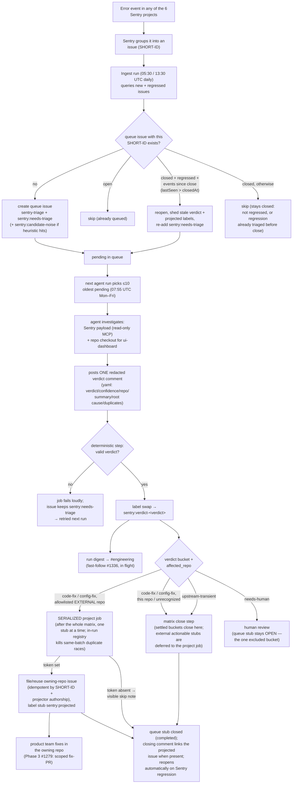

# Sentry triage pipeline

Operational reference for the staged Sentry issue triage/autofix pipeline
decided in [ADR 0036](../adr/0036-sentry-triage-pipeline.md). This note is
intentionally sectioned by pipeline stage: each stage's issue lands its own
section here so later stages (phased mutations, the push leg) extend this file
instead of rewriting it. Phase 1 = Stage A (deterministic ingest) + Stage B
(read-only triage verdicts).

## How it fits together

The life of a Sentry issue, in one paragraph: an error event lands in one of
the org's six Sentry projects; twice a day — every day, so nothing that
appears and gets resolved between sparser runs is missed — the deterministic
ingest turns every new or regressed issue group into one redacted queue issue
in this repo; each weekday morning the triage agent picks the oldest pending
batch, investigates
each via read-only Sentry access, and posts a structured verdict; a
deterministic workflow step validates the verdict, applies the matching label,
and — for every bucket except `needs-human` — closes the queue issue (state
reason: completed) with a fixed closing comment, so the queue reads as
work-in-flight instead of a growing archive; humans consume verdicts by
label — nothing is fixed, archived, or resolved **in Sentry** automatically in
Phase 1; closing only ever touches this repo's local ledger issue, and a
closed queue issue reopens automatically (Stage A's regression-reopen path)
once the underlying Sentry issue records events newer than the close.

### Architecture

```mermaid
flowchart LR
    subgraph SENTRY["Sentry — mento-labs org (6 projects)"]
        SE["error events,<br/>grouped into issues"]
    end

    subgraph GHA["GitHub Actions — this repo"]
        ING["<b>Stage A — ingest</b><br/>sentry-triage-ingest.yml<br/>deterministic script, 2×/day"]
        SEL["<b>Stage B — select</b><br/>10 oldest pending,<br/>oldest-first"]
        AGT["<b>Stage B — triage agents</b><br/>claude-code-action, ≤2 parallel<br/>read-only Sentry MCP"]
        LBL["<b>deterministic verdict step</b><br/>parse comment → validate →<br/>apply label (no LLM authority)"]
        CLOSE["<b>deterministic close step</b><br/>upstream + actionable-local →<br/>close (completed); needs-human<br/>stays open; external actionable<br/>deferred to the project job"]
        PROJ["<b>project job — SERIALIZED</b><br/>after the whole matrix, one at a<br/>time: external code-fix/config-fix →<br/>owning-repo issue, then close<br/>(Issues-write, no LLM authority)"]
        AFX["<b>autofix leg — Phase 2b</b><br/>sentry-autofix.yml (separate cron)<br/>LOCAL code-fix stubs → scoped fix<br/>agent (no Sentry access) → diff guard<br/>→ PR via App token (merge stays human)"]
        ARCH["<b>Phase 2a — archive</b><br/>sentry-triage-archive.yml<br/>human-approved, deterministic<br/>archived_until_escalating<br/>(never hard-resolve)"]
    end

    subgraph FIXES["Fix PRs — this repo (Phase 2b)"]
        FIXPR["scoped fix PR<br/>required CI + Codex review;<br/><b>merge stays human</b>"]
    end

    subgraph QUEUE["GitHub Issues — machine ledger"]
        QI["queue issues<br/><code>[sentry] SHORT-ID (project, level)</code><br/>redacted coordinates only<br/>closed once verdicted (except needs-human)"]
    end

    subgraph OWN["Owning repos — product teams (ADR 0038)"]
        REPOS["frontend-monorepo ·<br/>mento-analytics-api ·<br/>minipay-dapp<br/>(human-readable projected issues)"]
    end

    subgraph TF["Terraform platform stack"]
        SEC["SENTRY_TRIAGE_TOKEN (read-only)<br/>SENTRY_TRIAGE_ENABLED (kill switch)"]
        SECP["SENTRY_PROJECTION_TOKEN<br/>(Issues R/W, 3 owning repos)"]
        SECA["AUTOFIX_APP_* (App id + PEM)<br/>SENTRY_AUTOFIX_ENABLED (kill switch)"]
        SECAR["SENTRY_ARCHIVE_TOKEN (Issue R/W)<br/>SENTRY_ARCHIVE_ENABLED (kill switch)"]
    end

    subgraph OBS["Observability"]
        TRK["run record →<br/>tracker #1282"]
        CIF["workflow failures →<br/>#ci-failures"]
        ENG["per-run verdict digest →<br/>#engineering<br/>(fast-follow #1336, in flight)"]
    end

    HUM["humans — review verdicts,<br/>act per owning repo"]

    SE -- "REST: new + regressed<br/>(lookback window)" --> ING
    ING -- "1 redacted issue per group,<br/>idempotent by SHORT-ID" --> QI
    QI --> SEL --> AGT
    SE -. "full payload read at<br/>triage time (read-only)" .-> AGT
    AGT -- "verdict comment" --> QI
    LBL -- "sentry:verdict-* label" --> QI
    AGT --> LBL
    LBL --> CLOSE
    CLOSE -- "external actionable stubs<br/>deferred (left open)" --> PROJ
    PROJ -- "one issue per family,<br/>allowlisted owning repos only" --> REPOS
    PROJ -- "sentry:projected + link,<br/>then close (completed)" --> QI
    CLOSE -- "close (completed),<br/>settled buckets" --> QI
    QI -- "sentry:verdict-code-fix,<br/>local + no fix PR yet<br/>(cap 2/run)" --> AFX
    AFX -- "branch + PR via App token<br/>(required CI + review fire)" --> FIXPR
    AFX -- "Autofixed by PR: + label<br/>(ambient github.token)" --> QI
    SEC -. "gates + authenticates" .-> ING & SEL
    SECP -. "authenticates (Issues-write,<br/>project job ONLY)" .-> PROJ
    SECA -. "gates + authenticates<br/>(App token, autofix ONLY)" .-> AFX
    HUM -- "apply sentry:approved-archive<br/>on a verdicted stub" --> ARCH
    ARCH -- "archived_until_escalating<br/>(never hard-resolve)" --> SE
    ARCH -- "audit + sentry:archived,<br/>close (completed)" --> QI
    SECAR -. "gates + authenticates<br/>(archive job ONLY)" .-> ARCH
    ING --> TRK
    GHA -.-> CIF
    LBL --> ENG
    QI --> HUM
    REPOS --> HUM
    FIXPR --> HUM
```



### Process flow — life of one Sentry issue



Nothing in Phase 1 mutates Sentry or any codebase: the writes anywhere are the
queue issue (create/reopen/close), the verdict comment, the label, the
notifications, and — for actionable verdicts against an external owning repo —
a human-readable **issue** projected into that repo (Issues-write only, no code;
see "Verdict projection" below). Closing a queue issue never touches Sentry —
the underlying Sentry issue keeps whatever status it already had; only the
local ledger entry closes.

## Queue contract (v2)

Stage A (`scripts/sentry-triage-ingest.mjs`, `.github/workflows/sentry-triage-ingest.yml`)
turns every new or regressed Sentry issue across the `mento-labs` org into
exactly one GitHub queue issue in this repo. The contract below is normative —
Stage B (the read-only triage agent) and later phases build against it. Do not
change it without updating the ingest script and this doc together.

**v2 privacy rule (why this contract looks the way it does):** this repo is
PUBLIC, so raw Sentry payload text — issue titles, culprits, messages — would
publish production error data (ADR 0036). No payload-derived text may appear
anywhere in a queue issue: not in the title, not in the yaml block, not in
the human-readable section, not in comments. Queue issues carry only
Sentry-assigned identifiers, counters, and timestamps; triage reads the
actual payload in Sentry via the permalink. The raw title is still used
IN-MEMORY for noise classification — only the resulting label is public.

### Source

- Sentry org `mento-labs` (SaaS, region `https://us.sentry.io`), 6 projects
  across 4 repos: `analytics-mento-org`, `analytics-api`, `app-mento-org`,
  `governance-mento-org`, `minipay-dapp`, `reserve-mento-org`. Every project's
  issues funnel into this repo's queue via one org-wide endpoint — fix PRs in
  the owning repo are a later phase, not part of Stage A.
- `GET https://us.sentry.io/api/0/organizations/mento-labs/issues/`, paginated
  via `Link` response headers.
  - New issues: `query=is:unresolved firstSeen:-<N>d` — the lookback `<N>`
    defaults to 8 days and is configurable (integer 1-90) via the
    `SENTRY_TRIAGE_LOOKBACK_DAYS` env var, the `--lookback-days` CLI flag
    (flag wins), or the workflow's `lookback_days` dispatch input.
  - Regressed issues: `query=is:unresolved is:regressed`
- `Authorization: Bearer $SENTRY_TRIAGE_TOKEN` (read-only token; Stage A never
  writes to Sentry).

### Title

```text
[sentry] <SHORT-ID> (<project>, <level>)
```

Example: `[sentry] GOVERNANCE-MENTO-ORG-51 (governance-mento-org, error)`

`<SHORT-ID>` is the Sentry issue's own `shortId` (e.g.
`GOVERNANCE-MENTO-ORG-51`). The Sentry issue title is payload text and never
appears here (v2 privacy rule). The queue title is the sole idempotency key —
see below.

### Idempotency

Before creating an issue, search existing queue issues (**all states**) for a
title whose first whitespace-delimited token after the `[sentry]` prefix
equals `<SHORT-ID>`:

- **Open match** → skip.
- **Closed match, Sentry issue is regressed, and its `lastSeen` is strictly
  newer than the queue issue's `closed_at`** → reopen it, comment
  `Regressed in Sentry (last seen <ts>)`, re-add `sentry:needs-triage`, and
  remove any stale `sentry:verdict-*` labels plus the stale `sentry:projected`
  marker — the old verdict/projection described the old occurrence, and a
  reopened issue must read as awaiting triage, not as carrying a verdict (or a
  projection claim) and needs-triage at once. If the re-triage round lands on
  an actionable verdict again, the projection step re-applies the marker,
  idempotently reusing the same owning-repo issue. The timestamp gate exists
  because Sentry keeps `substatus=regressed` for days after a regression:
  without it, a verdict-closed stub would loop reopen → re-triage → close on
  every ingest run until Sentry flips the substatus. Missing or unparsable
  timestamps fail open toward triage (reopen) — a wrongly skipped regression
  is silent, a wrongly reopened one merely re-triages.
- **Closed match, otherwise** → skip (stays closed): not regressed, or a
  regression whose events all predate the close and were therefore already
  triaged before the ledger entry closed.
- **No match** → create.

At ~31 new issue groups/week org-wide, the ingest script does this as one
bulk scan per run (not one search per issue): it pages through the complete
`sentry-triage` label set, all states, with no result cap — a capped scan
would silently start duplicating older regressed issues once the queue
outgrows the cap.

**Queue hygiene counterpart:** the deterministic close step (verdict contract
below) closes verdicted queue issues so the tracker stays readable. To this
scan, a queue issue closed by the verdict-close step is just another "closed
match" — and the `lastSeen`-vs-`closed_at` gate above is what makes the
pairing loop-free: a regression with events newer than the close reopens for
re-triage, while Sentry's days-long `substatus=regressed` tail on an
already-triaged occurrence leaves the ledger entry closed.

### Labels

Every queue issue carries `sentry-triage` (the durable queue-namespace
marker, kept for the issue's lifetime) plus `sentry:needs-triage`.
`sentry:candidate-noise` is added when the raw Sentry title matches a noise
heuristic: `^Blocked '` (CSP reports), `TimeoutError`, `Failed to fetch`,
`Failed to load chunk`, `AbortError`. The classification runs in-memory
during ingest; the raw title itself never renders anywhere (v2 privacy
rule).

Queue issues never get the dev-backlog labels (`agent-ready`,
`needs-grooming`, etc.) — this is a disjoint label namespace so the two agent
queues can't cross-claim each other's work.

The ingest script idempotently bootstraps every pipeline label on each run
(`gh label create --force`), including the verdict labels Stage B will use
before Stage B exists, the `sentry:projected` marker the verdict-projection
step applies (see "Verdict projection" below), and the Phase-2a archive-loop
markers (see "Archive loop (Phase 2a)" below): `sentry-triage`,
`sentry:needs-triage`, `sentry:candidate-noise`, `sentry:verdict-code-fix`,
`sentry:verdict-config-fix`, `sentry:verdict-upstream`,
`sentry:verdict-needs-human`, `sentry:projected`, `sentry:approved-archive`,
`sentry:archived`.

Label glossary (namespace `sentry:*`, disjoint from the dev-backlog labels):

| label                        | applied by         | meaning                                                                  |
| ---------------------------- | ------------------ | ------------------------------------------------------------------------ |
| `sentry-triage`              | ingest             | queue-namespace marker, kept for the stub's whole lifetime               |
| `sentry:needs-triage`        | ingest / reopen    | awaiting a triage-agent verdict                                          |
| `sentry:candidate-noise`     | ingest             | raw title matched a noise heuristic (in-memory only)                     |
| `sentry:verdict-code-fix`    | verdict label step | verdict: fixable in the owning repo's code                               |
| `sentry:verdict-config-fix`  | verdict label step | verdict: fixable via configuration                                       |
| `sentry:verdict-upstream`    | verdict label step | verdict: upstream/third-party, not fixable here                          |
| `sentry:verdict-needs-human` | verdict label step | verdict: needs human judgment                                            |
| `sentry:projected`           | project job        | actionable verdict projected into the owning repo (ADR 0038)             |
| `sentry:approved-archive`    | **a human**        | human approval to archive the underlying Sentry issue (Phase 2a)         |
| `sentry:archived`            | archive script     | terminal: underlying Sentry issue archived (`archived_until_escalating`) |

A regression reopen (Stage A's idempotency scan) sheds every non-lifetime
marker — verdict, `sentry:projected`, `sentry:approved-archive`, AND
`sentry:archived` — so a reopened stub reads as awaiting fresh triage and never
carries a stale human archive approval into a new occurrence.

### Body

````text
<!-- sentry-triage:v1 -->

```yaml
short_id: "GOVERNANCE-MENTO-ORG-51"
sentry_issue_id: "6197137101"
project: "governance-mento-org"
level: "error"
status: "unresolved"
events: 42
users: 7
first_seen: "2026-07-01T00:00:00Z"
last_seen: "2026-07-14T10:00:00Z"
permalink: "https://mento-labs.sentry.io/issues/6197137101/"
```

[View in Sentry](<permalink>)
````

The yaml block deliberately has NO `title` or `culprit` fields, and the
human-readable section is only the permalink (v2 privacy rule above). All
Sentry-derived strings that do render are still treated as untrusted,
attacker-reachable text as defense in depth — never executed or evaled, and
neutralized before embedding:

- control characters and newlines collapsed;
- every backtick replaced with a look-alike character, so a hostile value can
  never close the yaml code fence early;
- a zero-width space inserted after every at-sign, so mention syntax like
  `@user` or `@org/team` can never become a live GitHub mention;
- yaml string fields hard-bounded at 200 chars ("truncate hard").

The permalink is only rendered as a clickable link when it parses as an
`https://\*.sentry.io` URL; otherwise the body falls back to plain text.

### Kill switch

The workflow's first step checks the repo Actions variable
`SENTRY_TRIAGE_ENABLED`. Anything other than the literal string `true` exits 0
with a `::notice::` — no Sentry or GitHub API calls made. As defense in depth,
the script itself also no-ops gracefully (exit 0, `::notice::`) when
`SENTRY_TRIAGE_TOKEN` isn't set, whether invoked from CI or locally.

### Run record

Each run posts (or updates a single rolling comment on, matched via the
`<!-- sentry-triage-ingest:run-record:v1 -->` marker) the tracker issue
([#1282](https://github.com/mento-protocol/monitoring-monorepo/issues/1282))
with a UTC timestamp and counts: fetched / created / skipped-existing /
reopened / errors. A missing run record — the workflow ran but the comment
never landed — is itself the alert signal for Phase 1; combined with the
schedule-failure Slack notifier (`.github/workflows/notify-slack-on-main-failure.yml`,
which this workflow is registered in), that covers both "the run crashed" and
"the run silently stopped mattering." A run with per-issue mutation errors
still posts the run record but exits nonzero, so the failure notifier fires
for systemic failure modes (bad token permission, API outage) too.

## Verdict contract

The read-only triage agent — `.github/workflows/sentry-triage-agent.yml`, driven
by the prompt in `.github/prompts/sentry-triage.md` — is Stage B of the Sentry
triage pipeline (ADR 0036). For each pending queue issue (`sentry-triage` +
`sentry:needs-triage`) it investigates the underlying Sentry issue (Sentry MCP,
read-only token + the repo checkout for `analytics-mento-org`) and posts exactly
one verdict comment. It never fixes code, never writes to Sentry, and never
opens PRs. Responsibility is deliberately split: **the LLM agent's only write is
the verdict comment; the verdict label is applied by a deterministic workflow
step** that parses the comment (see below) — the agent holds no label-editing
capability at all.

### Verdict comment

The comment starts with the marker `<!-- sentry-triage-verdict:v1 -->`, followed
by a fenced ` ```yaml ` block, followed by a short (≤ 15 line) human-readable
diagnosis.

Redaction rule: this repository is public, so the diagnosis (and every yaml
field) must never quote Sentry payload text, stack frames, parameterized URLs,
or user data verbatim — abstract descriptions plus the Sentry permalink only.
This mirrors the Stage A queue contract, which likewise keeps Sentry titles and
culprits out of queue-issue bodies.

```yaml
verdict: code-fix # code-fix | config-fix | upstream-transient | needs-human
confidence: medium # high | medium | low
affected_repo: mento-protocol/frontend-monorepo
summary: <one line>
root_cause: |
  <1-3 lines>
proposed_action: |
  <1-3 lines>
duplicate_of: [] # list of Sentry SHORT-IDs (e.g. GOVERNANCE-MENTO-ORG-51), possibly empty
# The four fields below are needs-human ONLY (absent for every other verdict).
# They turn an escalation into a decision-ready brief the #engineering digest
# renders first. human_question is REQUIRED for needs-human — the parser fails
# loud without it (see "Needs-human decision-ready brief" below).
human_question: |
  Decide whether to X or Y (the single concrete decision a human must make).
hypotheses:
  - Candidate root cause A (lean: medium)
  - Candidate root cause B (lean: low)
investigated:
  - What was checked / ruled out (payload evidence, code paths, dedup search)
escalation_reason: |
  Why this could not be resolved to a confident verdict.
```

Field semantics:

- `verdict` — the classification (see the four values below). Required.
- `confidence` — `high` / `medium` / `low`. Low confidence and `needs-human`
  both mean "a person should look before any action is taken".
- `affected_repo` — the owning repo for the error, e.g.
  `mento-protocol/frontend-monorepo` (app/governance/reserve), `mento-protocol/mento-analytics-api`
  (analytics-api), `mento-protocol/monitoring-monorepo` (analytics-mento-org →
  `ui-dashboard/`), or `mento-protocol/minipay-dapp`.
- `summary` — one line describing the error.
- `root_cause` — 1–3 lines. For non-`analytics-mento-org` projects the agent has
  no source checkout, so this is derived from Sentry evidence alone and says so.
- `proposed_action` — 1–3 lines describing the fix/config change/escalation.
- `duplicate_of` — Sentry SHORT-IDs of other queue issues in the same
  culprit/message family; empty when none found. The duplicate search spans
  **all** issue states (`gh issue list --state all`) — verdicted queue issues
  auto-close (see "Queue closing" below), so the ledger's triage history lives
  mostly in closed issues.

The four **needs-human decision-ready brief** fields are present ONLY on
`needs-human` verdicts (optional-absent, and ignored if present, for every
other verdict). They exist so each escalation reads as a decision, not "please
look" — the digest renders them first (see the digest section below):

- `human_question` — **REQUIRED for `needs-human`.** The single concrete
  question/decision a human must answer for the issue to proceed (1–2 lines;
  "decide X or Y", not "please look"). The single authoritative parser
  (`scripts/sentry-triage-project-core.mjs` `resolveVerdict`, run by the
  workflow's `--parse-only` label step) treats a `needs-human` verdict whose
  `human_question` is **absent OR a blatant non-decision placeholder** (an exact
  normalized match against a small denylist — "please look", "investigate
  this", "tbd", …) exactly like a missing/invalid verdict: **fail loud**, keep
  `sentry:needs-triage`, retry next run. This forces a lazy escalation to be
  redone rather than silently landing an undecidable `needs-human` label. The
  denylist is a deterministic backstop only — matched exactly so a real
  question that merely contains such a word is never rejected; the prompt makes
  the agent responsible for the actual decision quality.
- `hypotheses` — a yaml list (1–3) of candidate root causes with the agent's
  confidence lean.
- `investigated` — a yaml list of what the agent checked/ruled out (payload
  evidence, code paths read, dedup search).
- `escalation_reason` — why this could not be resolved to a confident verdict
  (ambiguity / security-sensitive surface / conflicting evidence).

Redaction applies to these fields exactly like the rest of the diagnosis:
abstract descriptions only, never Sentry payload text verbatim. They are
consumed only by the #engineering digest's needs-human brief (they never reach
a projected owning-repo issue — `needs-human` never projects), and every value
is neutralized + Slack-escaped there.

### Verdict label application (deterministic)

After the agent finishes, a deterministic step in
`.github/workflows/sentry-triage-agent.yml` (not the agent) reads the newest
marker-bearing comment on the queue issue, extracts the yaml `verdict` value,
validates it against exactly the four allowed values, removes
`sentry:needs-triage`, and adds the mapped verdict label. If no valid verdict
comment exists, the step fails the job loudly (`::error::` + exit 1) and leaves
`sentry:needs-triage` in place so the next scheduled run retries the issue — a
failed triage never silently strands an unlabeled issue.

**Single parser:** the parse itself is delegated to
`scripts/sentry-triage-project.mjs --parse-only` — the exact same
selection/validation code the verdict-projection step runs — so labeling and
projection can never disagree about what a verdict says. The projection step
additionally receives the label step's validated verdict back (`--verdict`)
and fails loudly if its own read ever differs (only possible if the issue
changed between steps), never silently skipping.

**Authorship fence:** only comments authored by the pipeline's own GitHub
Actions bot (`github-actions`; REST shape `github-actions[bot]`) are
considered — both for verdict comments and for regression-reopen comments.
This repo is public, so without the fence any drive-by commenter could paste a
marker-bearing comment and drive labels, closes, and (once the projection PAT
exists) cross-repo issue creation, or stale-out a legitimate verdict with a
fake regression comment. Comments with a missing/unknown author fail closed.

**Regression fence:** a reopened regression still carries the previous round's
verdict comment (Stage A's reopen path sheds labels, not comments). The step
therefore only accepts a verdict comment that is strictly newer than the
newest regression-reopen comment (`Regressed in Sentry (last seen …)`,
compared by comment `createdAt`); a stale pre-regression verdict is treated
exactly like a missing one — fail loudly, keep `sentry:needs-triage` — so a
regressed issue can never be re-labeled or re-closed off a verdict that never
investigated the regression. On first triage (no regression comment) the
fence is a no-op.

The verdict **value** maps to the verdict **label** as follows (label names are
owned by the Stage A queue contract / ingest bootstrap):

| verdict              | label                        |
| -------------------- | ---------------------------- |
| `code-fix`           | `sentry:verdict-code-fix`    |
| `config-fix`         | `sentry:verdict-config-fix`  |
| `upstream-transient` | `sentry:verdict-upstream`    |
| `needs-human`        | `sentry:verdict-needs-human` |

Note the deliberate asymmetry: the verdict value `upstream-transient` maps to the
label `sentry:verdict-upstream` (not `-upstream-transient`).

### Queue closing (deterministic)

Immediately after the label swap, in the same deterministic step and using the
same already-validated `verdict` value (never agent-authored text), the step
closes the queue issue for every bucket except `needs-human`:

| verdict                                        | queue issue                                                                           |
| ---------------------------------------------- | ------------------------------------------------------------------------------------- |
| `code-fix`, `config-fix`, `upstream-transient` | closed (`gh issue close --reason completed`)                                          |
| `needs-human`                                  | stays **open** — the one bucket that wants human eyes; a human closes it after acting |

The closing comment is fixed and deterministic — its only variables are the
validated four-value verdict enum and, for `code-fix`/`config-fix`, a
projection note built from the projection step's closed-enum status plus the
`gh`-returned owning-repo issue URL (never agent-authored comment text):

```text
Triage complete: <verdict>. Ledger entry closed; reopens automatically on Sentry regression.
```

For `code-fix`/`config-fix` the comment additionally records the projection
outcome between the verdict word and "Ledger entry closed" — the linked
owning-repo issue when one was filed/reused, or an explicit "Projection skipped
(SENTRY_PROJECTION_TOKEN not provisioned)." while the PAT is absent (visible,
not silent). See "Verdict projection" below.

This is queue hygiene only: it closes this repo's local ledger issue, never
the underlying Sentry issue (Sentry archival stays Phase 2a, human-approved,
a separate write-scoped token — see "What Phase 2 does with verdicts" below).
The regression-reopen path (Stage A's idempotency scan, above) is this step's
exact counterpart: a queue issue closed here reopens automatically once the
underlying Sentry issue records an event newer than the close (`lastSeen`
strictly newer than the queue issue's `closed_at`). That timestamp gate is
what keeps the pair loop-free — Sentry holds `substatus=regressed` for days,
so without it an already-triaged, just-closed stub would re-match the
regressed query and cycle reopen → re-triage → close every run.

For `code-fix`/`config-fix` verdicts against an external owning repo, the
verdict-projection step (ADR 0038, "Verdict projection" below) runs between the
label swap and this close, files the owning-repo issue, and the closing comment
links it.

**One-off backfill (queue hygiene, 2026-07):** activation-era queue issues
that already carry a non-`needs-human` verdict label predate this closing step
and need a single manual sweep, run once after this change merges — see
"Backfill (queue hygiene closing, one-off)" in the operator runbook below for
the exact command.

### How to read a verdict

- `code-fix` — a code change in the owning repo would fix it (bug, unhandled
  edge, bad assumption).
- `config-fix` — a configuration/infra change fixes it (CSP allowlist, env var,
  alert rule, third-party setting) — no application code change needed.
- `upstream-transient` — external outage/flake/user-environment noise; no action
  in our repos.
- `needs-human` — ambiguous root cause, a security-sensitive surface
  (auth/payments/keys), or conflicting evidence. The agent is instructed to pick
  this whenever uncertain — a wrong confident verdict is worse than an
  escalation.

A missing verdict comment on a `sentry:needs-triage` issue after a scheduled run
means the triage agent did not run or did not finish — treat it as a signal,
not as "no issues found".

### Observability (run record + per-run Slack digest)

ADR 0036's dominant failure mode is _unauditable automation going dark_, so the
pipeline surfaces itself two ways, and a break in either turns a run red:

- **Run record (Stage A).** Every ingest run updates the rolling
  `<!-- sentry-triage-ingest:run-record:v1 -->` comment on tracker issue
  [#1282](https://github.com/mento-protocol/monitoring-monorepo/issues/1282)
  with counts (see the Stage A "Run record" section). A missing update is a
  dead-man-switch signal.
- **Per-run Slack digest (Stage B).** After every triage run that processed at
  least one queue issue, the `digest` job in `sentry-triage-agent.yml` posts a
  deterministic, OUTCOME-oriented digest to Slack `#engineering` so verdict
  review needs zero GitHub polling. It is a pure CONSUMER of the verdict
  contract — no LLM, no label writes, no Sentry — driven by the collector
  `scripts/sentry-triage-digest.mjs`. For each batch issue it reads the current
  labels, the queue-issue body (for the Sentry permalink), and the latest
  pipeline-bot-authored `<!-- sentry-triage-verdict:v1 -->` comment (selected
  AND parsed by the SAME authoritative path the label/projection steps use —
  `selectVerdictComment` + `parseVerdictComment` from
  `sentry-triage-project-core.mjs`: authorship fence, explicit `createdAt`
  ordering (never API array order), and the regression fence — so a drive-by
  marker comment cannot feed text into the digest and the digest can never
  render a different comment than the one the pipeline acted on). It never
  re-validates
  `human_question`; that fail-loud gate is the `--parse-only` label step, so a
  `needs-human` stub reaching the digest already carries one.

  The digest keeps a header line (`N issue(s) triaged`) and the by-verdict
  counts line (`code-fix / config-fix / upstream-transient / needs-human /
failed triage`), then renders these sections **in this order, empty ones
  omitted**:
  1. **⚠️ Needs human — decisions required** — FIRST and visually distinct:
     each item is a decision-ready brief — the exact `human_question`, the
     `hypotheses`, what was `investigated`, the `escalation_reason`, and links
     to the queue issue + the Sentry permalink.
  2. **🤖 Autofixed** — actionable verdicts with recorded fix-PR data, each
     linking its fix PR. Renders ONLY when non-empty; stays empty until Phase 2b
     ([#1278](https://github.com/mento-protocol/monitoring-monorepo/issues/1278))
     lands. **#1278 emission interface:** the autofix leg posts a trusted-bot
     comment on the queue stub whose body is exactly
     `Autofixed by PR: <https github.com PR url>` (the `AUTOFIX_COMMENT_PREFIX`
     constant, mirroring the projection pointer below); the digest reads the
     newest such comment (authorship-fenced, URL shape-validated, and
     regression-fenced — see below) and links it.
  3. **📮 Routed to owning repo** — `code-fix`/`config-fix` verdicts, each
     `SHORT-ID — summary → link`. The link is the PROJECTED owning-repo issue,
     read from the projection step's machine-parseable
     `Projected to owning repo: <url>` pointer comment (the `PROJECTED_COMMENT_PREFIX`
     contract constant in `sentry-triage-project-core.mjs`). When projection was
     skipped (no PAT / local / unrecognized repo), it falls back to linking the
     queue-issue verdict. Both outcome pointers are **regression-fenced**: a
     queue stub reopened on a Sentry regression keeps its old pre-regression
     pointer comments, so the digest only reads a pointer strictly newer than
     the newest `Regressed in Sentry (last seen …)` comment — a re-triaged issue
     can't inherit a stale projection link or be misplaced into Autofixed off a
     previous occurrence's fix PR.
  4. **🙅 Wontfix / transient** — `upstream-transient` verdicts, each linking
     the rationale (the verdict comment lives on the linked queue issue).
  5. **🛑 Failed triage** — batch issues still carrying `sentry:needs-triage`
     (their matrix job died before a verdict landed) — kept visible, never
     hidden.

  The job runs `if: always()` gated on a non-zero select count, so it posts even
  when some triage matrix jobs failed (partial visibility via the failed-triage
  section) but stays silent on empty batches and kill-switch no-ops.

  Security: every free-form value (summary + the four needs-human brief fields,
  plus the short-id/project lifted from the queue title) is agent-authored from
  untrusted Sentry data, so it is neutralized and Slack-escaped with the same
  `& < >` escape the main-failure notifier uses
  (`.github/workflows/notify-slack-on-main-failure.yml`) — the escape that makes
  Slack mention/link syntax (`<!channel>`, `<@U…>`) inert — and every section
  text object keeps `verbatim: true`. Section text stays under Slack's
  3000-char cap by bounding each field before escaping and chunking each section
  independently (2800/section); the needs-human section chunks at whole-brief
  boundaries, so a decision brief never splits across Slack blocks mid-entry.
  The URLs the digest turns into links are
  shape-validated first (queue/projected/fix = https `github.com`, Sentry
  permalink = https `*.sentry.io`). The bot token
  (`secrets.TF_VAR_SLACK_BOT_TOKEN`, `chat:write.public`, reused — no new
  secret) reaches only the posting step; the channel is hardcoded in the
  workflow (changing it is a one-line PR). A digest-job failure fails the run,
  which `notify-slack-on-main-failure.yml` (where this workflow is registered)
  surfaces to `#ci-failures`.

### What Phase 2 does with verdicts (forward-looking)

Phase 1 is read-only by design: verdicts and labels only, no fixes and no Sentry
writes (ADR 0036, Stage B). Later phases consume these labels, each gated on the
previous phase's measured verdict accuracy — not on elapsed time:

- `sentry:verdict-upstream` → candidate for the human-approved archive step
  (Phase 2a), which may only ever set Sentry issues to
  `archived_until_escalating`, never hard-resolve.
- `sentry:verdict-code-fix` → candidate for scoped fix-PR generation in the
  owning repo (Phase 2b+), which runs through required CI and independent
  (Codex) review like any other PR.
- `sentry:verdict-config-fix` and `sentry:verdict-needs-human` → stay with a
  person.

## Verdict projection

The central queue is a machine ledger; the human artifact for an actionable
finding lives where the product team works. **Verdict projection** (ADR 0038)
is the deterministic, no-LLM leg that turns a `code-fix`/`config-fix` verdict
for an EXTERNAL owning repo into a proper, readable issue in that repo. It
runs as a dedicated **SERIALIZED `project` job** in
`.github/workflows/sentry-triage-agent.yml` — after the whole triage matrix
settles — driven by `scripts/sentry-triage-project.mjs --batch` (`gh` I/O +
orchestration + CLI; the pure logic lives in
`scripts/sentry-triage-project-core.mjs`, re-exported by the entry; tests in
`scripts/sentry-triage-project.test.mjs`). Serialization is deliberate, for
two reasons:

- **Race-class kill.** Two duplicate-family SHORT-IDs in one batch could
  otherwise both pass the projection lookup in parallel matrix jobs — a
  just-created issue is not searchable for seconds-to-minutes — and
  double-file. The batch runs in ONE node process, one stub at a time, with an
  in-run registry of everything it already projected/reused, so a same-run
  family always coalesces regardless of search-index lag. Registration is
  symmetric in batch order (every settlement registers the issue under its own
  SHORT-ID and its declared duplicates, so it coalesces whether the declaring
  or the referenced stub processes first, and a registry-satisfied member
  still persists its alias comment durably) and registry keys are
  repo-qualified, so a family whose members name different owning repos never
  aliases across repositories.
- **Token isolation.** `SENTRY_PROJECTION_TOKEN` reaches only this job's
  single step; the matrix jobs that host the LLM agent never see it.

The matrix close step settles `upstream-transient`, actionable-LOCAL, and
`needs-human` stubs itself (using `--parse-only`'s `projectable`
classification) and DEFERS actionable EXTERNAL stubs — left open,
verdict-labeled — to the project job, which projects and then closes each with
the projected URL in the fixed closing comment. Per-stub failures compensate
exactly like the matrix (restore `sentry:needs-triage`, shed verdict +
projected labels) and turn the job red without blocking the rest of the batch.

It is a pure CONSUMER of the verdict contract — it re-reads each stub's title,
yaml body, and latest `<!-- sentry-triage-verdict:v1 -->` comment through the
SAME authoritative parser the label step uses (`--parse-only` above),
including the authorship and regression fences, and never re-fetches Sentry,
runs an LLM, or touches the verdict/label logic. The label-derived verdict is
cross-checked against the script's own fresh parse; if they ever differ (only
possible when the issue changed between jobs), that stub fails loudly rather
than silently skipping.

**When it projects.** Only `code-fix`/`config-fix`; `needs-human` and
`upstream-transient` never leave the queue. The verdict's `affected_repo` is
UNTRUSTED agent text, validated against a FIXED allowlist —
`mento-protocol/frontend-monorepo`, `mento-protocol/mento-analytics-api`,
`mento-protocol/minipay-dapp`. Anything else is a no-op:
`mento-protocol/monitoring-monorepo` (this repo — its errors are fixed here)
quietly, an unrecognized value with a `::warning::` (treated as this repo). This
allowlist is the entire trust boundary for the cross-repo write.

**What it files.** Title `Sentry: <summary>`; body = only the
redaction-governed verdict-contract fields (summary, root cause, proposed
action, confidence, possible duplicates), the Sentry permalink, a back-link to
the queue stub, and a fixed footer — no raw Sentry payload is fetched or copied.
Every agent-derived string is neutralized the same way the Stage A queue body is
(control chars stripped, backticks defanged so a hostile value can't break a
code fence, `@` defanged so it can't become a live GitHub mention); multi-line
fields render inside fenced blocks so embedded markdown is inert; the SHORT-IDs,
permalink, and back-link are shape-/scheme-validated before they render.

**Idempotency.** Before creating, the owning repo is searched across **all**
states (SHORT-ID ANDed with a fixed footer phrase as a sharp pre-filter, 200
result cap; the hidden `<!-- sentry-projection:v1 SHORT-ID -->` back-link
marker is the authoritative match — accepted only in the body's LEADING marker
block (the first line plus any coalescing alias lines directly under it), and
HTML-comment openers are defanged in every rendered field so a spoofed marker
inside verdict text can never impersonate it) for an existing projected
issue; a match is reused, never duplicated. A genuine match
must ALSO be **authored by the projector identity itself** (the PAT's own
login, resolved via `gh api user` under the projection token) — anyone with
Issues access in an owning repo could pre-create a marker-shaped issue, and a
hostile one must not steal the projection slot. This makes projection safe
across regression reopen → re-triage cycles (the same SHORT-ID reuses the same
owning-repo issue). A **closed** match is reopened first, with a fixed
regression comment, so the regression resurfaces for the product team instead
of silently linking a closed issue.

**Duplicate coalescing.** When the verdict's `duplicate_of` names a SHORT-ID
that already has a genuine projection (same leading-marker + author checks),
that issue is reused instead of filing a second owning-repo issue for the same
underlying bug: the new SHORT-ID is persisted as an **alias comment** on the
reused issue — its first line is the marker (the authoritative alias
predicate, accepted only from the projector identity) and its visible part
carries the SHORT-ID, the footer phrase, the queue-stub back-link (the
`in:body,comments` search pre-filter matches visible text) **and the new
occurrence's full rendered verdict fields** (summary/root cause/proposed
action, neutralized and bounded like the projected body). `duplicate_of` is a
same-culprit/message **family** signal, not a confirmed exact duplicate, so
nothing is discarded: the alias comment is the new finding's record, with an
explicit invitation to split it into its own issue if it is actually
distinct. An alias is deliberately a comment, never a body edit: comment
creation is an atomic APPEND, so two parallel matrix jobs coalescing
different SHORT-IDs onto the same issue can never lose each other's alias the
way concurrent read-modify-write body edits could (GitHub offers no
conditional body update), and it is the ONLY coalescing side effect, so a
partial failure can never strand a half-recorded alias. Future regressions of
that SHORT-ID then resolve to the same issue via the primary lookup even when
a fresh verdict omits or changes `duplicate_of`, and retries take the plain
reused path without re-commenting. Lookup cost is bounded without ever
truncating past a genuine match: dup IDs are deduplicated, self-excluded, and
only then capped (5); the cheap body-marker scan runs across ALL
author-matched candidates; and alias comments are found via a dedicated
exact-phrase search (`"Also tracking Sentry <SHORT-ID>" in:comments`) that
essentially only genuine aliases can match — if that ever returns an
implausible candidate count (>10 projector-authored issues), the lookup fails
loud into the compensation path rather than risk skipping the real alias.

**Queue-stub side effects.** On a successful projection (created or reused) the
stub gets the `sentry:projected` label plus a comment linking the projected
issue, then the project job closes it with the projected URL in the fixed
closing comment. That pointer comment has a fixed, machine-parseable form —
`Projected to owning repo: <url>` (the `PROJECTED_COMMENT_PREFIX` constant in
`scripts/sentry-triage-project-core.mjs`) — because the outcome digest's
"Routed" section reads it (authorship-fenced, URL shape-validated) to link the
projected owning-repo issue. Keep the two in sync via that shared constant. The
`sentry:projected` label is bootstrapped by the ingest label set (Stage A
"Labels").

**Credential + isolation.** The cross-repo create/search use a dedicated
fine-grained PAT (`sentry-triage-projector`, Issues Read+Write on exactly the
three owning repos — no contents, no pull-requests), stored as the
`count`-gated Actions secret `SENTRY_PROJECTION_TOKEN` in the platform Terraform
stack (ADR 0030). It is exposed on the serialized project job's single step
ONLY — the triage matrix jobs (which host the LLM agent, whose allowlist and
permissions are untouched) never see it. The local stub label/comment use the
ambient `github.token` (issues:write on this repo); the PAT is never used for
a local call. While the secret is absent on `main` the job is a graceful
per-stub no-op, and each stub's closing comment records the skip (visible, not
silent). The token is additionally **ref-gated**: on any non-`main` ref
(branch `workflow_dispatch` would run that branch's modified workflow/script
code) the env expression resolves to empty — a local-repo verdict still
resolves and closes normally in the matrix, but an actionable EXTERNAL
verdict is loudly re-queued (needs-triage restored, verdict + projected
labels shed, job fails) so a non-main dispatch can never consume a stub that
was never projected; the next `main`-ref run retries it. Durable
GitHub-Environment protection for this dispatch surface is tracked in
[#1289](https://github.com/mento-protocol/monitoring-monorepo/issues/1289).
Cross-repo fix **PRs** remain a later phase (ADR 0036 Stage C Phase 3,
[#1279](https://github.com/mento-protocol/monitoring-monorepo/issues/1279)) —
this job is Issues-write only.

**Failure handling.** On any projection failure the job compensates exactly
like the matrix close step — restore `sentry:needs-triage`, shed the verdict label and
any partially-applied `sentry:projected`, and fail the job loudly so the
main-failure notifier fires and the next scheduled run retries. Nothing
strands.

## Autofix PRs (Phase 2b)

Autofix is the first leg that WRITES code (ADR 0036 Stage C, Phase 2b). For a
queue stub verdicted `code-fix` whose parsed `affected_repo` is EXACTLY this
repo, a claude-code-action agent implements a scoped fix in a fresh checkout,
and a deterministic finalize step commits, pushes a branch, and opens a PR via a
GitHub App token. It is **PR-only** — nothing ever merges automatically; merge
stays human. It runs as its own scheduled workflow
(`.github/workflows/sentry-autofix.yml`), separate from the triage workflow, on
a weekday cron (`30 8 * * 1-5`, after the ~07:55 triage run) plus a
single-issue `workflow_dispatch` live run (opens a real fix PR if the issue is
eligible — there is no non-mutating dry-run mode). Helpers:
`scripts/sentry-autofix-select.mjs` (selection) and
`scripts/sentry-autofix-finalize.mjs` (diff guard + PR-body assembly), both with
offline tests.

**Containment (two layers).** First, the fix agent gets NO Sentry access at all
— no MCP server, no `--mcp-config`. Its only inputs are the already-posted,
redacted verdict comment (read via `gh issue view`) and this repo's own code, so
the prompt-injection surface stays confined to the read-only triage leg.
Second — and this is the load-bearing one, because the verdict is still
second-order untrusted data — the agent has **NO code-execution tool and no
GitHub token**: its allowlist is `Read`/`Grep`/`Glob`/`Edit`/`Write`/`MultiEdit`
ONLY, with no `pnpm`, `node`, `Bash`, `git`, `gh`, or network (mirroring the
repo's other claude-code-action agents in `claude.yml`). A code-execution tool
would let a verdict-injected agent run arbitrary JS with the runner's env
secrets and exfiltrate them before the diff guard ever runs; denying execution
removes that path entirely. The verdict is **pre-fetched** (trusted, fence-
selected) to `/tmp/autofix-verdict.md`, which the agent reads — so it needs no
`gh` tool and no GitHub token in its process env. The worst a prompt-injected
fix agent can now do is produce a bad DIFF, which the mechanical diff guard, the
fix PR's required CI, and human review all catch. And the LLM step holds NO
branch/PR write credential — the App token (branch push + PR create authority)
is minted and used EXCLUSIVELY inside the deterministic finalize steps, never in
the LLM step's env, so an injected instruction cannot push or open a PR because
the step that could be injected has nothing to push with. **Verification is not
the agent's job**: it cannot run tests, so the fix PR's own full required CI
(typecheck, tests, lint) plus independent review is the verification — which is
exactly why merge stays human.

_Residual (accepted, tracked):_ `anthropics/claude-code-action` still holds its
own `github_token` input and the Claude OAuth token in the CLI process env,
which the agent's unrestricted `Read` tool could in principle reach via a
process-environment surface and then write into an edited file or the summary.
This exposure is inherent to the action and identical to the repo's existing
`claude.yml` agents; the OAuth token is inference-only and rotatable, and any
leak would have to survive human PR/comment review. Full OS-level
process/filesystem sandboxing of the agent is a follow-up.

**Selection (deterministic).** The select job lists `sentry:verdict-code-fix`
queue stubs across `--state all` (verdicted stubs auto-close — closed is the
normal state), re-parses each verdict through the SAME authoritative parser the
triage label step uses (`sentry-triage-project-core.mjs` `resolveVerdict`), and
keeps only stubs whose `affected_repo` resolves to EXACTLY
`mento-protocol/monitoring-monorepo` (an unrecognized value is not treated as a
confident local classification, so it is skipped). Dedup: a stub already
carrying `sentry:fix-pr-opened` (a PR was opened) or `sentry:fix-refused` (an
attempt declined to open one) is skipped. A stub whose SHORT-ID is
quoted-referenced by an **open** PR (`gh pr list --state open --search
"\"<SHORT-ID>\""`) is a special case: because both terminal markers were
already filtered out above, an open PR here means the stub has NEITHER marker
yet a fix PR exists — a prior run's `gh pr create` succeeded but its follow-up
queue comment/label write did not land (a transient failure or a same-tick
race). Such a stub is **not dropped** (that would leave its queue side-effects
permanently unrepaired, since the reconcile path is only reachable after
selection); it is emitted as a `reconcile: true` matrix entry that the fix job
routes to a **no-agent reconciliation step** — no agent runs (so the checkout
stays untainted), no App token is minted, and no PR is pushed: it just
re-resolves the open PR and re-applies the `sentry:fix-pr-opened` marker +
`Autofixed by PR` comment (or exits cleanly if a concurrent run already did, or
if the PR has since merged/closed). Routing it through the agent instead would
risk mislabeling it `sentry:fix-refused` when the re-run diff differs. Quoting
forces exact-phrase matching so an unrelated PR that merely mentions the
tokens — or a longer SHORT-ID sharing the prefix — can't falsely dedup an
eligible stub; scoping to open PRs means a merged/closed fix PR no longer blocks
— once a fixed issue regresses, the ingest reopen sheds the autofix markers
(`REOPEN_SHED_LABELS`) and the stub is re-attemptable by design. Oldest-first,
**hard-capped at 2 per run** (quota cap). The single-issue `workflow_dispatch`
live run evaluates one requested issue through the same filters (an eligible
issue opens a real PR). The whole workflow runs **only from `main`** (the select job
no-ops on any other ref): the pristine base is pinned to `github.sha`, so a
dispatch from a feature ref would make that ref the base and its divergence from
`main` would bypass the 3-file diff guard and land in the PR (which opens against
`main`). Scheduled runs are always on `main`.

**Diff guard (mechanical, not just prompt-enforced).** After the agent edits,
the finalize step detects the changes and refuses — posting a no-PR analysis
comment on the queue stub, marking it `sentry:fix-refused`, exiting cleanly —
when the diff has zero changes, more than 3 changed files, ANY changed path on
a forbidden surface, a changed path the agent turned into a **symlink**, or a
changed file whose CONTENT is **credential-shaped**. Forbidden surfaces:
prefixes `.github/`, `terraform/`, `patches/`, `.trunk/`, `tools/`; a
`scripts/` directory at ANY depth (root tooling AND package-local helpers like
`ui-dashboard/scripts/` — several workflows execute package scripts from the
PR head with secrets in env, e.g. the Lighthouse deploy-protection bypass);
and CI-executed config files anywhere (`package.json`, `pnpm-lock.yaml`,
`.npmrc`, any `pnpmfile`, `vercel.json`, `turbo.json`, `*.config.{js,ts,…}`,
`lighthouserc*`, `*.sh`, `Dockerfile*`, `*.yml`/`*.yaml`). The symlink
rejection is credential-free (it runs in the guard step, before the App token
is minted) and lstat-only: the filter-free detector does not dereference
symlinks, so without it an agent could replace an allowed source file with a
symlink to a secret-bearing path (e.g. `/proc/self/environ`) that the later
credentialed byte-copy would dereference and publish into the public fix branch.
The credential scan closes the sibling channel: the documented process-env
residual means an injected agent could READ runner tokens and write them into
an allowed source file — the guard scans every changed file for known
credential shapes (GitHub/Anthropic/Slack/AWS prefixes) and refuses the whole
attempt, since a pushed branch is public before any human review. (This is a
known-prefix scan, not an entropy heuristic; the strong guarantee against
token disclosure comes from the deterministic-body policy below, and this scan
is defense-in-depth over the code diff.) The prompt states the same limits,
but the guard enforces them in code so an over-eager or injected agent cannot
land a forbidden-path, sprawling, or secret-exfiltrating diff.

**No agent free-text is ever published.** The fix-PR body and the no-PR
analysis comment are assembled from DETERMINISTIC templates only — the agent
writes no summary that reaches a public surface. This is deliberate: the agent
runs with a `Read` tool that can reach the runner's process environment (the
documented residual), and any pattern-based redactor over free text is
bypassable — a token fragmented across whitespace (`ghs_ABC DEF …`) matches no
credential shape or length threshold, then reconstructs for a reader. The only
non-bypassable policy for arbitrary untrusted text on a public surface is to
not publish it. So the authoritative artifact is the reviewed **diff** (for a
fix PR — a human reviews it against the linked Sentry issue) or the
deterministic guard **reason** (for a refusal); the agent's working notes stay
in the non-public run logs.

The `sentry:fix-refused` marker is what stops a genuinely unfixable stub from
being re-picked on every schedule and burning the per-run cap forever
(starvation): the selector excludes it server-side exactly like
`sentry:fix-pr-opened`. A human retries a refused stub by **removing the label**;
a regression reopen sheds it automatically (`REOPEN_SHED_LABELS`), since it
described the old occurrence.

**Tainted-checkout containment (no git on the checkout, ever).** The agent has
`Write` access to the checkout, which includes the untracked `.git/` — so a
prompt-injected agent could plant a `pre-commit`/`fsmonitor` hook, a
`url.insteadOf` rewrite, or a clean/smudge filter, and ANY git command run
against that checkout (even `git add`/`git diff`/`git status`) would execute or
redirect it — hardened flags do not disable in-tree `.gitattributes` filters.
The finalize flow therefore never runs git against the tainted checkout at all:
(1) `persist-credentials: false` keeps the checkout token out of `.git/config`;
(2) the agent's changes are detected against a PRISTINE clone at the run's base
commit using **pure filesystem reads** (`sentry-autofix-finalize.mjs diff-trees`
content-hashes both trees — no git, so no filter/hook/textconv runs), and the
result is fed to the same diff guard; (3) EVERY deterministic node helper runs
from that pristine clone (the helper scripts are themselves agent-editable in
the checkout, so `scripts/` is a forbidden diff path AND the helpers are never
executed from the checkout); and (4) the guard-approved files are re-created in a
copy of the pristine clone by BYTE-COPYING them with `cp` (never git-reading the
checkout), and git only ever touches that pristine-config copy — so
agent-planted hooks/rewrites/filters have nothing to hijack and the App token
never reaches a git command that consults agent-controlled config.

**PR authorship + why an App token.** When the guard passes, the finalize step
mints a short-lived installation token from the `sentry-autofix` GitHub App
(app-id `AUTOFIX_APP_ID` variable, private-key `AUTOFIX_APP_PRIVATE_KEY`
secret), re-creates THIS run's guard-approved files in the pristine clone (byte
copy), commits them as the App bot identity on branch
`sentry-autofix/<short-id-lower>`, pushes with the App token, and opens the PR
with the App token. An App-token push
(unlike a `github.token` push) triggers downstream workflows, so **required CI
and Codex review actually fire**
on the fix PR — the whole point of using an App rather than the ambient token.
Because that CI executes the PR head's product/test code before any human
review, every `ci.yml` checkout runs with `persist-credentials: false`: no
checkout token ever sits in `.git/config` where PR-head code (autofix-authored
or otherwise) could read and exfiltrate it — CI jobs only lint/test/build and
never need an authenticated git remote (the repo is public, so plain fetches
are anonymous).

**CI trust boundary (issue #1388 — was an activation gate, now enforced).**
Autofix PRs pass every historical CI trust check (same-repo, non-fork,
non-Dependabot), so every secret-bearing `pull_request` lane must treat the
`sentry-autofix/*` head branch as UNTRUSTED explicitly:

- `lighthouse.yml` routes autofix PRs to the secretless deterministic-fixture
  lane — they never receive the Vercel deploy-protection bypass secret, which
  the preview lane sends as a request header to the PR's OWN server code.
- The four Terraform-family plan jobs (`governance-watchdog`, `alerts-infra`,
  `alerts-rules`, `aegis-terraform`) skip autofix PRs entirely: `terraform
plan` executes PR-head HCL, and the plan job holds a state-reading SA.
  (Defense in depth — the diff guard also forbids `*.tf`/`*.hcl`/`*.tfvars`
  at any depth.)
- `claude.yml` skips auto-review on autofix PRs (feeding an untrusted diff to
  an LLM holding `pull-requests: write` invites steered, misleading
  commentary; Codex review + the human merge gate remain).
- `scripts/check-autofix-ci-trust.mjs` (CI `scripts` job + the quality gate)
  enforces the boundary structurally by parsing each workflow with `js-yaml`
  and analyzing the parsed structure (issue #1424 replaced an earlier
  textual-regex version): no `pull_request_target` anywhere, and every
  credential-bearing (`secrets`, `id-token`/`write-all`, or `environment:`)
  `pull_request` job must carry a `sentry-autofix/` guard or an
  `# autofix-ci-trust:` justification
  annotation. A new secret lane added without reasoning about autofix trust
  fails CI. Checklist: `docs/pr-checklists/ci-workflow-gates.md` §10.
  The PR body is assembled deterministically from a fixed template (`## The
Problem` / `## The Solution` referencing the SHORT-ID, plus `Fixes <SHORT-ID>`,
  `Refs <queue issue #>`, and a provenance note that the PR was machine-authored
  from a triage verdict and enters the normal review gauntlet). It contains **no
  agent-authored text** — see "No agent free-text is ever published" above; the
  diff is the artifact a human reviews.

**Branch collisions + orphan recovery.** If the branch already exists AND
already has a PR, that PR is left untouched (it may be under review) and the run
just marks the stub — though the selector's SHORT-ID PR-search dedup normally
stops such a stub from being picked at all. If the branch exists but has NO PR,
it is an _orphan_: a prior run pushed the fix but its `gh pr create` failed,
leaving a branch with no PR, so the selector kept re-picking the stub forever.
The finalize step recovers by force-overwriting that branch with THIS run's
guard-checked content and opening the missing PR — never a permanent silent
no-op, and never a PR whose diff was not validated by the run that opened it
(the force-push is safe: the branch holds no PR, lives in the pipeline's own
`sentry-autofix/` namespace, and runs are concurrency-serialized).

`Fixes <SHORT-ID>` in the PR description is Sentry's release-linked auto-resolve
keyword: Sentry references the fix and marks the issue resolved in the release
that ships the merge commit (verified against
<https://docs.sentry.io/product/releases/associate-commits/>, 2026-07).

**Queue-stub side effects.** After opening the PR, the finalize step — using the
AMBIENT `github.token` so the comment is authored by `github-actions` (the
outcome digest's authorship fence) — posts the machine-parseable
`Autofixed by PR: <url>` comment (the `AUTOFIX_COMMENT_PREFIX` contract the
digest's "Autofixed" section reads) and applies the `sentry:fix-pr-opened`
label, self-healed first from the ingest's `LABEL_DEFINITIONS` single source.
The App token is never used for these local writes.

**Stale-verdict withdrawal (a terminal path, not a failure).** The marker is
written under a re-read of `sentry:verdict-code-fix` taken immediately before and
again after the label write (issue #1389). Ingest runs in its own concurrency
group and can shed the verdict on a regression re-queue while the fix PR is being
opened; marking the stub fixed off that stale verdict would suppress the re-fix
the regression must trigger. So if the verdict is gone at either check, the
finalize step **closes the PR it opened** (the selector dedups on an open autofix
PR too, so skipping the label alone would not free the stub), removes the marker
if it had already applied it, and posts a `fix not finalized … reconsidered after
re-triage` comment **instead of** the `Autofixed by PR:` comment and
`sentry:fix-pr-opened` marker. An operator seeing a just-opened autofix PR closed
with that comment and no `sentry:fix-pr-opened` label is looking at this
deliberate outcome, not an orphaned or failed run — the stub is intentionally
left selectable so the regression gets a fresh fix. A close that cannot be
confirmed after retries fails the run loudly rather than leaving a stale open PR
masquerading as withdrawn.

**Run record (observability).** A final `record-run` job runs on every
**on-`main`** autofix run — scheduled runs and `main` dispatches, including when
the leg is disabled, unprovisioned, finds zero candidates, or selection itself
failed — and upserts a single rolling comment (its own
`<!-- sentry-autofix:run-record:v1 -->` marker, distinct from the ingest's) on
tracker issue
[#1282](https://github.com/mento-protocol/monitoring-monorepo/issues/1282) with
the timestamp, trigger, disposition, and the candidates-selected /
PRs-opened / refused / incomplete tallies (read back from the selected stubs'
`sentry:fix-pr-opened` / `sentry:fix-refused` labels, so no matrix-output
plumbing is needed). It is best-effort and least-privileged (`issues: write`
only, no Claude/App credential): a failed tracker write never reds the run,
because a MISSING record is itself the dead-man-switch signal. This mirrors the
ingest run record and satisfies the ADR 0036 observability invariant, whose
purpose is to detect a silently-dead **schedule**. An **off-`main`
`workflow_dispatch`** (a developer testing the workflow from a feature branch)
deliberately leaves **no** tracker record: the `record-run` job is gated to
`github.ref == refs/heads/main` because a dispatch runs the _dispatched ref's_
workflow + helper code, so recording off-main would mean executing unreviewed
feature-branch code with the `issues:write` token. An off-main dispatch is not
a scheduled run, so its absence from the ledger is not a false-healthy signal —
the `select` job's own no-op notice is the record for that case.

**Merge stays human.** Nothing in this leg merges. The fix PR is an ordinary PR:
required CI, independent Codex review, and a human approving the merge —
identical to any hand-written change. This is the accepted residual in ADR 0036:
a `code-fix` verdict triggers automated branch/PR creation bounded by the
per-run cap, the diff guard, and the review gauntlet — but never an automated
merge.

## Archive loop (Phase 2a)

Phase 2a is the first leg that mutates **Sentry**. It is deterministic
(zero-LLM) and human-gated: a person decides, the workflow executes. It runs as
`.github/workflows/sentry-triage-archive.yml` driven by
`scripts/sentry-triage-archive.mjs` (tests: `pnpm sentry:archive:test`).

**The one thing automation may ever do to a Sentry issue here:** set it to
`archived_until_escalating` — never a hard resolve (ADR 0036). Escalation must
be able to resurface a mistaken archive; hard-resolve stays a human action
everywhere.

### Human approval flow

1. A human reviews a verdicted queue stub (typically a `sentry:verdict-upstream`
   noise finding, but any verdict qualifies) and, if they want the underlying
   Sentry issue archived, applies the **`sentry:approved-archive`** label.
2. The `labeled` event triggers the archive workflow, which — before any
   mutation — runs two deterministic guards:
   - **Approval authority.** The actor who applied the label (or, on the
     `workflow_dispatch` retry path, the dispatching actor) must be a human
     (`type == "User"`, login not ending in `[bot]`) with `admin` or `write`
     permission on this repo, checked via
     `GET /repos/{owner}/{repo}/collaborators/{login}/permission`. A drive-by
     label from anyone else is refused: the label is removed, an audit comment
     explains why, and the run **exits 0** (a policy refusal, not a red run).
   - **Verdict guard.** The stub must carry the `sentry-triage` marker, the
     `sentry:approved-archive` approval, AND at least one `sentry:verdict-*`
     label. An un-verdicted stub is refused (comment + approval label removed +
     exit 0) so nothing is archived without triage.
3. On success the archive script archives the Sentry issue
   (`archived_until_escalating`, idempotent — an already-archived issue is a
   logged no-op), posts an audit comment on the queue stub, swaps
   `sentry:approved-archive` → `sentry:archived`, and closes the stub
   (`completed`).

The LLM triage agent holds NO part of this: it never applies
`sentry:approved-archive` (only a human does) and never sees the write-scoped
token. The approval label is the entire human-in-the-loop gate.

### What qualifies

Any verdicted stub a human chooses. The workflow does not restrict archiving to
`upstream-transient` — an operator may legitimately archive a `needs-human` or
`config-fix` stub they have decided to accept — but it hard-refuses anything
un-verdicted. Because a Sentry issue archived here only stays archived **until
it escalates**, a wrong archive is self-correcting: Sentry resurfaces it and the
regression-reopen path re-queues it (see below).

### Never auto-archive

Archiving is never triggered by a verdict alone. ADR 0036 fixes this as the
trust boundary: a leaked or wrong verdict cannot mutate Sentry by itself —
archiving requires a human-applied approval label, and the token that performs
it is write-scoped and reachable only from this one workflow's one step.

To keep that approval from going stale under a concurrent regression, the
archive script re-reads the stub's LIVE labels twice — once immediately before
the Sentry mutation and again immediately before it closes/relabels the stub —
and refuses if the `sentry:approved-archive` or verdict labels have been shed
(e.g. by an ingest regression-reopen) in between. If the reopen lands during the
Sentry I/O — after the archive PUT but before settlement — the script actively
**reverts** its own archive (restores the Sentry issue to `unresolved`) rather
than leaving it hidden, so the regression stays surfaced and the queue stub is
left open for re-triage. The common path is already race-free because ingest
only ever reopens a CLOSED stub, and the stub stays OPEN throughout the archive
until the final settle. The sub-second residual between the last re-read and the
close is irreducible without cross-workflow lock-step serialization (GitHub has
no conditional close); tightening that is a tracked follow-up.

### Audit trail

Every archive leaves a fixed-marker (`<!-- sentry-triage-archive:v1 -->`) audit
comment on the queue stub recording the approver login, a UTC timestamp, what
was archived, and the Sentry permalink, before the stub closes. The marker also
makes the settle idempotent: a `workflow_dispatch` retry of an already-settled
stub does not double-post.

### Escalation → auto-reopen accuracy loop

`archived_until_escalating` is the pivot that makes archiving low-risk. When an
archived issue escalates/regresses in Sentry, Stage A's ingest sees it in the
`is:regressed` query and — because its `lastSeen` is now newer than the queue
stub's `closed_at` — reopens the stub, sheds every stale marker (verdict,
`sentry:projected`, `sentry:approved-archive`, `sentry:archived`), and re-adds
`sentry:needs-triage`. The reopened stub reads as awaiting fresh triage and
carries no stale human approval, so a fresh archive needs a fresh approval. A
wrong archive therefore costs, at most, one escalation round-trip — the loop
measures and self-corrects instead of silently burying a real bug.

**Don't close over an in-flight regression.** That reopen gate has a sharp edge:
a regression that lands while the stub is still OPEN (between the human approval
and the archive run) is invisible to ingest — `decideDedupAction` skips OPEN
stubs — so it never sheds the approval. If the archive then closed the stub
_after_ that regression's `lastSeen`, ingest's `lastSeen > closedAt` gate would
skip the regression forever (until some further event). The archive script
therefore checks Sentry's live substatus first and, if the issue is currently
`regressed`/`escalating`, refuses to archive: it re-queues the stub
(`sentry:needs-triage`, approval + verdict labels shed) for fresh triage instead
of closing over the regression. The residual — a regression Sentry has not yet
flagged when the archive runs — is tightened only by full ingest/archive
synchronization (tracked follow-up).

### Undocumented Sentry comment endpoint (caveat)

The archive script also attempts a best-effort link-back note on the Sentry
issue pointing at the queue stub. Sentry's issue-comment ("note") REST endpoint
is **not in the public API reference** (verified 2026-07), so the call is
wrapped in try/catch and a failure only logs a `::notice::` — it can NEVER fail
the run, because the archive itself already succeeded. The exact endpoint/payload
**needs a live test at activation** (see the `NEEDS A LIVE TEST` code comment in
`scripts/sentry-triage-archive.mjs`).

### Activating the archive loop

The archive leg is a separate, later activation from Phase 1 and verdict
projection. It stays a graceful no-op until BOTH its write-scoped token exists
AND `SENTRY_ARCHIVE_ENABLED` is `"true"`.

1. **Mint the write-scoped Sentry token.** In Sentry (org `mento-labs`), create
   a SECOND internal integration named `sentry-triage-archiver` with scopes
   **Issue & Event: Read + Write** and NOTHING else (no Project, no
   Organization, no Member). Do NOT reuse or widen the read-only
   `sentry-triage-reader` token — the read and write credentials are deliberately
   separate. Copy the generated token.
2. **Set it in the platform tfvars.** In your local, gitignored
   `terraform/terraform.tfvars`, set `sentry_archive_token` (see
   `terraform/terraform.tfvars.example` for the key). Same value source as the
   other `count`-gated platform secrets — never `gh secret set`, never the
   GitHub UI.
3. **Plan and apply the platform stack (human-approved local apply).** Run
   `pnpm infra:plan` and confirm the new
   `github_actions_secret.sentry_archive_token` resource appears (absent while
   the tfvar is empty); `SENTRY_ARCHIVE_ENABLED` is provisioned by the same
   apply in its default `"false"` (off) position. After human sign-off, run
   `pnpm tf apply platform` from a clean `main` checkout. The apply mirrors the
   value into the repo Actions secret `SENTRY_ARCHIVE_TOKEN`. Brand-new, no
   external consumer, so no `prevent_destroy` — emptying the tfvar later cleanly
   removes it (the workflow reverts to the no-op).
4. **Flip the kill switch to activate.** Once the archive workflow PR is merged
   and the token is applied, set `sentry_archive_enabled = "true"` in
   `terraform.tfvars` and re-apply the platform stack (still IaC). The workflow
   activates on the next `sentry:approved-archive` label.
5. **Verify.** Apply `sentry:approved-archive` to a verdicted stub as a
   write/admin user and confirm the Sentry issue flips to
   `archived_until_escalating`, the stub gets the audit comment + `sentry:archived`
   and closes, and (at activation) confirm the undocumented Sentry link-back
   note either lands or fails gracefully. To pause, set
   `sentry_archive_enabled = "false"` and re-apply; the token can stay in place.

## Operator runbook (Phase-1 activation)

Phase 1 provisions two read-limited credentials and one kill-switch variable
entirely through the platform Terraform stack (`terraform/`, ADR 0030
IaC-before-CLI): `github_actions_secret.sentry_triage_token`,
`github_actions_secret.claude_code_oauth_token`, and
`github_actions_variable.sentry_triage_enabled`. The two secret mirrors are
`count`-gated on their tfvar being non-empty, so the Terraform code can merge
and apply before the tokens exist. The pipeline stays inert until both tokens
are set **and** `SENTRY_TRIAGE_ENABLED` is `"true"`.

All token values live only in the platform stack's gitignored, operator-held
`terraform/terraform.tfvars` (the same file that supplies `lifi_api_key` and the
other `count`-gated platform secrets) — never committed, never set through
`gh secret set` or the GitHub UI.

1. **Mint the read-only Sentry token.** In Sentry (org `mento-labs`), create an
   internal integration named `sentry-triage-reader` with READ-ONLY scopes:
   _Issue & Event: Read_, _Project: Read_, _Organization: Read_. Add no write
   scopes — Phase 2 mints a separate write-scoped token only if and when
   auto-archive is approved (ADR 0036 trust boundary). Copy the generated token.
2. **Mint the Claude OAuth token — this rotates a shared live secret.**
   `CLAUDE_CODE_OAUTH_TOKEN` already exists as a live repo secret consumed by
   both `.github/workflows/claude.yml` jobs (the on-demand Claude assistant and
   the auto-review job), and GitHub cannot read secret values back, so the
   Terraform adoption necessarily writes a new value over the live one. Locally,
   on the Max plan, run `claude setup-token` to mint a fresh one-year,
   inference-only OAuth token. The first apply (step 4) overwrites the live
   secret with this fresh token — a rotation, not an outage: `claude.yml` and
   the triage workflows then share the new value. Do not put a placeholder or
   stale token here; a bad value breaks the existing Claude PR automation on its
   next run.
3. **Set both values in the platform tfvars.** In your local, gitignored
   `terraform/terraform.tfvars`, set `sentry_triage_token` and
   `claude_code_oauth_token` (see `terraform/terraform.tfvars.example` for the
   keys and placeholder comments). This is the exact same value source the
   `count`-gated integration-probe secrets already use. Once
   `claude_code_oauth_token` has been applied, never empty it again: the count
   gate would plan a destroy of the shared live secret, which the resource's
   `prevent_destroy` lifecycle guard rejects at plan time (deliberately loud —
   rotate by replacing the value, not by clearing it).
4. **Plan and apply the platform stack (human-approved local apply).** Run
   `pnpm infra:plan` and confirm the two new `github_actions_secret` resources
   appear (they are absent while the tfvars are empty); the
   `CLAUDE_CODE_OAUTH_TOKEN` "create" is an upsert that overwrites the existing
   live secret (see step 2). After human sign-off,
   run `pnpm tf apply platform` from a clean `main` checkout. The platform stack
   is manual-plan / manual-apply (`terraform.stacks.json` →
   `apply: "manual"`, `applyPolicy: "human-review-required"`); it is **not** a
   CI `production-infra` apply like the alerts/aegis/governance-watchdog stacks.
   The apply mirrors the two values into the repo Actions secrets
   `SENTRY_TRIAGE_TOKEN` and `CLAUDE_CODE_OAUTH_TOKEN`. `SENTRY_TRIAGE_ENABLED`
   is provisioned by the same apply in its default `"false"` (off) position.
   After the apply, sanity-check the rotation by triggering any PR's Claude
   auto-review (or an on-demand mention) and confirming `claude.yml` still
   authenticates.
5. **Flip the kill switch to activate.** Once both Phase-1 workflow PRs
   (`sentry-triage-ingest`, `sentry-triage-agent`) are merged and the two tokens
   are applied, set `sentry_triage_enabled = "true"` in `terraform.tfvars` and
   re-apply the platform stack (still IaC, not the GitHub UI). The scheduled
   workflows activate on their next run.

To pause the pipeline at any time, set `sentry_triage_enabled = "false"` and
re-apply; the secrets can stay in place.

After flipping the switch, watch the next scheduled runs (ingest 05:30/13:30
UTC daily, agent 07:55 UTC weekdays) or trigger `workflow_dispatch` manually from the
`main` ref. Only the ingest workflow guards against dispatch from other refs
(`github.ref == 'refs/heads/main'` job guard); the agent workflow's
branch-dispatch hardening is tracked in
[#1289](https://github.com/mento-protocol/monitoring-monorepo/issues/1289)
(GitHub-Environment protection). Confirm the run-record comment lands on
tracker issue
[#1282](https://github.com/mento-protocol/monitoring-monorepo/issues/1282).

### Activating verdict projection (ADR 0038)

Projection is a separate, later activation from the read-only pipeline above:
the projection step is a graceful `::notice::` no-op until its PAT exists, so
the pipeline runs fine without it. When the team is ready to file owning-repo
issues automatically:

1. **Mint the `sentry-triage-projector` fine-grained PAT.** In GitHub (a bot or
   service account with access to the three owning repos, or an owner), create a
   **fine-grained** personal access token named `sentry-triage-projector`:
   - **Resource owner:** `mento-protocol`.
   - **Repository access → Only select repositories:** EXACTLY
     `frontend-monorepo`, `mento-analytics-api`, `minipay-dapp` — no others.
   - **Repository permissions → Issues: Read and write.** Set NOTHING else — no
     Contents, no Pull requests, no metadata beyond the mandatory read. This is
     the whole trust boundary; do not widen it (cross-repo fix PRs are Phase 3,
     [#1279](https://github.com/mento-protocol/monitoring-monorepo/issues/1279),
     and mint their own credential if/when approved).
   - Give it a bounded expiry and copy the generated token.
2. **Set it in the platform tfvars.** In your local, gitignored
   `terraform/terraform.tfvars`, set `sentry_projection_token` (see
   `terraform/terraform.tfvars.example` for the key and placeholder). Same value
   source as the other `count`-gated platform secrets — never `gh secret set`,
   never the GitHub UI.
3. **Plan and apply the platform stack (human-approved local apply).** Run
   `pnpm infra:plan` and confirm the new `github_actions_secret.sentry_projection_token`
   resource appears (absent while the tfvar is empty). After human sign-off, run
   `pnpm tf apply platform` from a clean `main` checkout. The apply mirrors the
   value into the repo Actions secret `SENTRY_PROJECTION_TOKEN`. Unlike
   `claude_code_oauth_token`, this secret is brand-new with no external consumer,
   so it carries no `prevent_destroy` — emptying the tfvar later cleanly removes
   it (projection reverts to the no-op).
4. **Verify.** On the next `code-fix`/`config-fix` verdict for an external
   owning repo, confirm an owning-repo issue is filed, the queue stub carries
   `sentry:projected` + a link comment, and the stub closes with the projected
   URL in its closing comment. To rotate, replace the tfvar value and re-apply —
   **with a PAT minted by the SAME account**: projected-issue reuse is
   author-keyed to the PAT's own login, so switching to a different account
   orphans existing projections' idempotency matching (re-projections would file
   duplicates instead of reusing).

### Activating autofix PRs (Phase 2b)

Autofix is a separate, later activation from the read-only pipeline and from
verdict projection: its select job is a graceful no-op until the App credential
AND the `SENTRY_AUTOFIX_ENABLED` switch exist, so the rest of the pipeline runs
fine without it. When the team is ready to open scoped fix PRs automatically:

1. **Create the `sentry-autofix` GitHub App.** GitHub → Settings → Developer
   settings → GitHub Apps → New GitHub App:
   - **Repository permissions → Contents: Read and write** and **Pull requests:
     Read and write.** Set NOTHING else — no Issues, no Actions, no webhooks.
     This is the whole trust boundary; the ambient `github.token` (not the App)
     does the local queue-stub comment/label, so the App needs no Issues scope.
   - **Where can this GitHub App be installed?** Only this account; then install
     it on `mento-protocol/monitoring-monorepo` ONLY.
   - Record the **App ID**; generate a **private key** (downloads a PEM).
2. **Set both values in the platform tfvars.** In your local, gitignored
   `terraform/terraform.tfvars`, set `autofix_app_id` and
   `autofix_app_private_key` (see `terraform/terraform.tfvars.example` for the
   keys and the PEM heredoc shape). Same value source as the other `count`-gated
   platform secrets — never `gh secret set`, never the GitHub UI.
3. **Plan and apply the platform stack (human-approved local apply).** Run
   `pnpm infra:plan` and confirm the new `github_actions_variable.autofix_app_id`
   and `github_actions_secret.autofix_app_private_key` resources appear (absent
   while the tfvars are empty). After human sign-off, run `pnpm tf apply platform`
   from a clean `main` checkout. The apply mirrors the values into the repo
   Actions variable `AUTOFIX_APP_ID` and secret `AUTOFIX_APP_PRIVATE_KEY`;
   `SENTRY_AUTOFIX_ENABLED` is provisioned by the same apply in its default
   `"false"` (off) position. Both autofix secrets are brand-new with no external
   consumer, so no `prevent_destroy` — emptying a tfvar later cleanly removes it
   (autofix reverts to the no-op).
4. **Flip the autofix kill switch to activate.** Once this workflow PR is merged
   and the App is applied, set `sentry_autofix_enabled = "true"` in
   `terraform.tfvars` and re-apply the platform stack (still IaC, not the GitHub
   UI). The scheduled autofix workflow activates on its next weekday run; verify
   with a single-issue `workflow_dispatch` LIVE run against a known local
   `code-fix` stub first — there is no dry-run mode: an eligible stub gets a
   real agent run and a real fix PR (which is the verification).
5. **Verify + the merge-stays-human rule.** On the next local `code-fix` verdict,
   confirm a `sentry-autofix/<short-id-lower>` branch and PR are opened by the
   App bot, required CI and Codex review run on the PR, the queue stub carries
   `sentry:fix-pr-opened` + an `Autofixed by PR: <url>` comment, and — critically
   — **nothing merges automatically.** A human reviews and merges the fix PR like
   any other change; that gate is never automated (ADR 0036).

**Backfill after an outage or at first activation:** the ingest's default
firstSeen window is 8 days, so Sentry issues first seen during a longer inert
or broken period fall outside the next scheduled scan. Run one manual
`workflow_dispatch` of `Sentry Triage Ingest` from `main` with the
`lookback_days` input widened (integer up to 90, e.g. `30`), or run
`pnpm sentry:ingest --lookback-days 30` locally with a `SENTRY_TRIAGE_TOKEN`.
Idempotency makes a too-wide window harmless — existing queue issues are
skipped.

**Backfill (queue hygiene closing, one-off):** the deterministic close step
(#1338) only closes queue issues going forward, from the run it merges in. It
does not retroactively close activation-era queue issues that already carry a
non-`needs-human` verdict label. Run this once after the #1338 PR merges (not
before — closing before the deterministic step exists would leave those
issues without the fixed closing comment's guarantee that a future regression
reopens them the same way). It is idempotent: `--state open` means a rerun is
a no-op for issues the first run already closed.

```bash
REPO="mento-protocol/monitoring-monorepo"

close_verdicted() {
  local label="$1" verdict="$2"
  gh issue list --repo "$REPO" --label sentry-triage --label "$label" --state open --json number --jq '.[].number' |
    while read -r n; do
      gh issue close "$n" --repo "$REPO" --reason completed \
        --comment "Triage complete: ${verdict}. Ledger entry closed; reopens automatically on Sentry regression."
    done
}

close_verdicted sentry:verdict-code-fix code-fix
close_verdicted sentry:verdict-config-fix config-fix
close_verdicted sentry:verdict-upstream upstream-transient
```

## Verification

```bash
pnpm sentry:ingest --dry-run   # needs a local SENTRY_TRIAGE_TOKEN; prints mutations without applying them
pnpm sentry:ingest:test        # node --test scripts/sentry-triage-ingest.test.mjs
pnpm sentry:digest:test        # node --test scripts/sentry-triage-digest.test.mjs (offline)
pnpm sentry:project:test       # node --test scripts/sentry-triage-project.test.mjs (offline)
pnpm sentry:autofix:select:test   # offline: autofix selection filters + dedup + cap
pnpm sentry:autofix:finalize:test # offline: autofix diff guard + PR-body assembly
# Print the Slack digest payload for a batch without posting (needs gh auth):
SENTRY_TRIAGE_ISSUES='[123,456]' pnpm sentry:digest --channel '#engineering'
# Project a single verdicted stub (needs gh auth + SENTRY_PROJECTION_TOKEN for a
# real cross-repo write; prints the JSON result). Absent token -> graceful no-op:
SENTRY_PROJECTION_TOKEN=… pnpm sentry:project --issue 123
# Print the autofix candidate batch (needs gh auth); read-only, opens nothing:
pnpm sentry:autofix:select --cap 2
```
