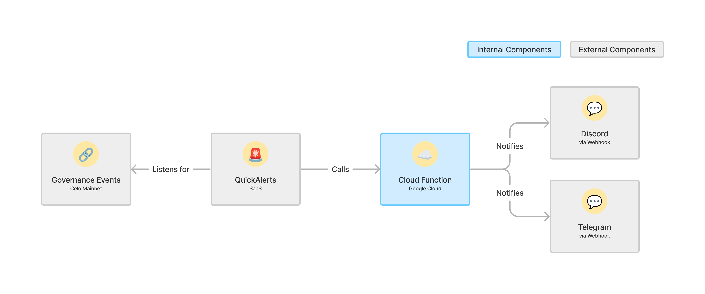

<!-- agent-context: title="Governance Watchdog" status=active owner=eng canonical=true last_verified=2026-07-17 doc_type=runbook scope=governance-watchdog review_interval_days=90 garden_lane=operator-runbooks -->

# 🐕 Governance Watchdog

> **Architecture decisions** for this service live in [`docs/adr/`](../docs/adr/README.md) (scope: `governance-watchdog`) — read the relevant ADR before changing how it deploys or is structured; it records the _why_ the code can't.

<!-- markdown-link-check-disable -->

A system that monitors Mento Governance events on-chain and sends notifications about them to Discord and Telegram. Mento Devs can view the [full project spec in our Notion.](https://www.notion.so/mentolabs/Governance-Watchdog-d168a8110a53430a90e2f5ab65f103f5?pvs=4)

<!-- markdown-link-check-enable -->

- [GCP Project Setup](#gcp-project-setup)
- [Local Setup](#local-setup)
- [Running and testing the Cloud Function locally](#running-and-testing-the-cloud-function-locally)
- [Testing the Deployed Cloud Function](#testing-the-deployed-cloud-function)
- [Updating the Cloud Function](#updating-the-cloud-function)
- [Adding New Events](#adding-new-events)
- [Developing QuickNode Webhook Filter Functions](#developing-quicknode-webhook-filter-functions)
  - [Workflow](#workflow)
  - [Filter Function Structure](#filter-function-structure)



## GCP Project Setup

This service lives in its own dedicated GCP project (not `mento-alerts` or
`mento-monitoring`). The project is created **by Terraform**, not by hand:
[`infra/main.tf`](./infra/main.tf) feeds `var.project_name`
(`governance-watchdog`) into the project-factory module with
`random_project_id = true`, so the real project ID carries a random suffix
(e.g. `governance-watchdog-b2a6`) and is only knowable after the first
explicitly approved bootstrap apply.

- **Existing deployment (the normal case):** the project already exists. Find
  its ID via
  `gcloud projects list --filter="name:governance-watchdog" --format="value(projectId)"`
  or `terraform -chdir=infra output project_id`. `pnpm run cache:clear`
  performs this lookup and caches it (see `bin/get-project-vars.sh`).
- **No project yet (from-scratch bootstrap):** follow
  [DEPLOY_FROM_SCRATCH.md](./DEPLOY_FROM_SCRATCH.md) **first**. You need the
  org ID and billing account (`gcloud organizations list`,
  `gcloud billing accounts list`) plus `roles/iam.serviceAccountTokenCreator`
  on the shared Terraform service account; the explicitly approved bootstrap
  apply then creates the project and everything in it. Every Local Setup step below that runs
  `gcloud secrets versions access` or `terraform state show` fails until that
  first apply has succeeded.

## Local Setup

1. Install the `gcloud` CLI

   ```sh
   # For macOS
   brew install google-cloud-sdk

   # For other systems, see https://cloud.google.com/sdk/docs/install
   ```

1. Install `trunk` — one linter to rule them all

   ```sh
   # For macOS
   brew install trunk-io

   # For other systems, check https://docs.trunk.io/check/usage
   ```

   Optionally, you can also install the [Trunk VS Code Extension](https://marketplace.visualstudio.com/items?itemName=Trunk.io)

1. Install `jq` — used in a few shell scripts

   ```sh
   # For macOS
   brew install jq

   # For other systems, see https://jqlang.github.io/jq/
   ```

1. Install `terraform` — to deploy and manage the infra for this project

   ```sh
   # For macOS
   brew tap hashicorp/tap
   brew install hashicorp/tap/terraform

   # For other systems, see https://developer.hashicorp.com/terraform/install
   ```

1. Run terraform setup script

   ```sh
   # Checks required permissions, provisions terraform providers and modules, syncs terraform state
   ./bin/set-up-terraform.sh
   ```

1. Set your local `gcloud` project and cache project values used in shell scripts:

   > Requires the GCP project to already exist — see [GCP Project Setup](#gcp-project-setup).

   ```sh
   # Will set the correct gcloud project in your terminal and populate a local cache with values frequently used in shell scripts
   pnpm run cache:clear
   ```

1. Create a `./infra/terraform.tfvars` file. This is like `.env` for Terraform:

   ```sh
   touch ./infra/terraform.tfvars
   # This file is `.gitignore`d to avoid accidentally leaking sensitive data
   ```

1. Add the following values to `infra/terraform.tfvars`. Follow the lookup
   instructions for each value or obtain individual values through their
   approved owner and secret-sharing channel. Never share or copy another
   developer's complete tfvars file.

   > These lookups read from the **deployed** project; for a from-scratch bootstrap use [DEPLOY_FROM_SCRATCH.md](./DEPLOY_FROM_SCRATCH.md) instead.

   ```hcl
   # Required for creating new GCP projects
   # Get it via `gcloud organizations list`
   org_id               = "<our-org-id>"

   # Required for creating new GCP projects
   # Get it via `gcloud billing accounts list` (pick the GmbH account)
   billing_account      = "<our-billing-account-id>"

   # Fine-grained GitHub PAT scoped to monitoring-monorepo with Secrets read/write.
   # Use the same value as alerts/infra's github_token.
   github_token         = "<github-token>"

   # The Discord Channel where we post mainnet notifications to
   # Get it via `gcloud secrets versions access latest --secret discord-webhook-url`
   # You need the "Secret Manager Secret Accessor" IAM role for this command to succeed
   discord_webhook_url  = "<discord-webhook-url>"

   # The Discord Channel where we post test notifications to
   # Get it via `gcloud secrets versions access latest --secret discord-test-webhook-url`
   # You need the "Secret Manager Secret Accessor" IAM role for this command to succeed
   discord_test_webhook_url  = "<discord-test-webhook-url>"

   # The Telegram Chat where we post mainnet notifications to
   # Get it via `terraform state show "google_cloudfunctions2_function.watchdog_notifications" | grep TELEGRAM_CHAT_ID | awk -F '= ' '{print $2}' | tr -d '"'`
   telegram_chat_id     = "<telegram-chat-id>"

   # The Telegram Chat where we post test notifications to
   # Get it via `terraform state show "google_cloudfunctions2_function.watchdog_notifications" | grep TELEGRAM_TEST_CHAT_ID | awk -F '= ' '{print $2}' | tr -d '"'`
   telegram_test_chat_id = "<telegram-test-chat-id>"

   # The Telegram bot used to receive and post notifications
   # NOTE: Make sure to also invite @MentoGovBot to the TG chat you want to post notifications to!
   # Get it via `gcloud secrets versions access latest --secret telegram-bot-token`
   telegram_bot_token   = "<telegram-bot-token>"

   # An auth token we use to be able to test deployed functions from our local machines
   # Get it via `gcloud secrets versions access latest --secret x-auth-token`
   x_auth_token         = "<x-auth-token>"

   # Required for Terraform to be able to create & destroy Quicknode Webhooks
   # Get it from the [QuickNode dashboard](https://dashboard.quicknode.com/api-keys)
   quicknode_api_key    = "<quicknode-api-key>"

   # Read the deployed value with `gcloud secrets versions access latest --secret quicknode-security-token`
   # and place it in ./infra/terraform.tfvars.
   quicknode_security_token = "<quicknode-security-token>"

   # Required to send on-call alerts to VictorOps
   # Get it from [our VictorOps](https://portal.victorops.com/dash/mento-labs-gmbh#/advanced/stackdriver) and clicking `Integrations` > `Stackdriver` and copying the URL. The routing key can be founder under the [`Settings`](https://portal.victorops.com/dash/mento-labs-gmbh#/routekeys) tab
   victorops_webhook_url   = "<victorops-webhook-url>/<victorops-routing-key>"

   # Slack notification channel ID for error alerts
   # This channel is created via OAuth in GCP Console (not managed by Terraform).
   # Bootstrap or rotate the matching
   # TF_VAR_GOVERNANCE_WATCHDOG_SLACK_NOTIFICATION_CHANNEL_ID repository secret
   # for plan jobs, and keep the production-infra Environment secret in sync for
   # gated applies. Do not reuse the alerts-owned
   # TF_VAR_SLACK_NOTIFICATION_CHANNEL_ID secret.
   # To find the ID:
   #   `gcloud beta monitoring channels list --project=governance-watchdog-b2a6 --format='table(name,displayName,type)'`
   # Or via UI:
   #   1. Go to https://console.cloud.google.com/monitoring/alerting/notifications?project=governance-watchdog-b2a6
   #   2. Find your Slack channel under "Slack" and click it
   #   3. The channel ID is in the URL: .../notificationChannels/<THIS_IS_THE_ID>
   slack_notification_channel_id = "<slack-channel-id>"
   ```

1. Auto-generate a local `.env` file by running `pnpm run generate:env` — we'll need this to run the cloud function locally. The command reads Terraform state and `infra/terraform.tfvars`; it does not run `terraform apply`.

1. Verify that everything works

   ```sh
   # See if you can fetch logs of the watchdog cloud function
   pnpm run logs

   # See if you can manually trigger the deployed watchdog function with some dummy data
   # Make sure to delete the fake posts from the Telegram & Discord channels to not spam channel members too much
   pnpm run test:prod:ProposalCreated
   ```

## Running and testing the Cloud Function locally

- `pnpm install`
- `pnpm run dev` to start a local cloud function with hot-reload via nodemon
- `pnpm run test:local:<EventName>` to call the local cloud function with a mocked payload for the respective event, this will send Telegram & Discord messages into the respective test channels

## Testing the Deployed Cloud Function

You can test the deployed cloud function manually by using the `src/events/fixtures/<event-type>.fixture.json` which contains a similar payload to what a Quicknode Webhook would send to the cloud function:

```sh
pnpm run test:prod:<EventName> # i.e. pnpm run test:prod:ProposalCreated
```

## Updating the Cloud Function

The normal deploy path is a PR against this repo. After merge to `main`,
`.github/workflows/governance-watchdog.yml` re-plans the
`governance-watchdog/infra` stack and applies through the `production-infra`
GitHub Environment when the stack root changed. The environment approval is the
human gate; do not deploy uncommitted or stale local state with a local
Terraform apply wrapper.

For a code-only break-glass update to an already deployed function, use the
`gcloud` helper by running `pnpm run deploy:function`.

- How? The pnpm script will:
  - Look up the service account used by the cloud function
  - Impersonate our shared Terraform Service Account to avoid individual permission issues
  - Call `gcloud functions deploy` with the correct parameters
- Pros
  - Familiar way of deploying cloud functions
  - More log output making deployment failures slightly faster to debug
  - Slightly faster because we're skipping the terraform state lookup
- Cons
  - Will lead to slightly inconsistent terraform state (because terraform is tracking the function source code and its version)
  - Will only work for updating a pre-existing cloud function's code, will fail for a first-time deploy

## Adding New Events

Want to add support for new blockchain events? See the detailed guide in **[ADDING_EVENTS.md](./ADDING_EVENTS.md)**.

The guide covers:

- **Event Configuration**: Define event types, interfaces, validation rules, and message composition
- **Message Builders**: Use Discord and Telegram message builders with helper methods
- **Deduplication**: Choose the right strategy to prevent duplicate notifications
- **Testing**: Create fixtures, add test scripts, and verify your implementation locally and in production

The centralized event system makes adding new events straightforward—just update a few type definitions and configurations, and the event registry handles the rest automatically

## Developing QuickNode Webhook Filter Functions

QuickNode webhooks use the `evmAbiFilter` template to match blockchain events by ABI event signature. Filter configuration (ABI and contract addresses) lives in the comment header of each filter file under [`infra/quicknode-filter-functions/`](./infra/quicknode-filter-functions/).

> **Note:** The `filter_function` base64 blobs in `infra/quicknode.tf` and the old `bin/update-quicknode-filter.js` script are **legacy artefacts**. They are not deployed — `ignore_all_server_changes = true` in Terraform prevents Terraform from pushing any changes to existing webhooks. All deploys go through `bin/deploy-quicknode-filter.sh`.

### Workflow

1. **Edit the filter file** at [`infra/quicknode-filter-functions/sorted-oracles.js`](./infra/quicknode-filter-functions/sorted-oracles.js) or [`governor.js`](./infra/quicknode-filter-functions/governor.js).

   The comment header at the top of each file is the deployment source of truth:

   ```js
   /*
   template: evmAbiFilter
   abi: [{...}]
   contracts: 0xYourContractAddress
   */
   ```

2. **Commit your changes** — the deploy script refuses dirty working trees so that only reviewed, committed filter code ships to the live webhooks.

3. **Deploy to QuickNode** using the deploy script:

   ```sh
   ./bin/deploy-quicknode-filter.sh --webhook healthcheck   # SortedOracles
   ./bin/deploy-quicknode-filter.sh --webhook governor      # MentoGovernor
   ./bin/deploy-quicknode-filter.sh                         # both
   ```

   This reads the ABI and contract addresses from the comment header, builds the `templateArgs` payload, and calls `PATCH /webhooks/{id}/template/evmAbiFilterGo` to apply the update live (no downtime).

4. **Verify** by checking the [QuickNode Webhooks Dashboard](https://dashboard.quicknode.com/webhooks) or inspecting the raw webhook via:

   ```bash
   curl -X GET "https://api.quicknode.com/webhooks/rest/v1/webhooks/$webhook_id" \
     -H "x-api-key: $quicknode_api_key"
   ```

### Filter Function Structure

The filter functions follow QuickNode's `evmAbiFilter` template:

- They decode blockchain events using the contract ABI
- They filter for specific event types and contract addresses
- They can include custom filtering logic (e.g., filtering by specific token addresses)
- They return matching events or `null` if no matches found

> **Important quirk:** The `evmAbiFilter` template filters by topic hash only — the `contracts` address filter in `templateArgs` is currently **silently ignored** by QuickNode's API. All addresses that emit a matching event signature will trigger the webhook. Address filtering must be done in the Cloud Function handler.

See the [QuickNode Webhooks documentation](https://www.quicknode.com/docs/webhooks/getting-started) for more details on filter function syntax.

## Deploying from Scratch

Need to deploy the entire system to a new GCP project? See the complete guide in **[DEPLOY_FROM_SCRATCH.md](./DEPLOY_FROM_SCRATCH.md)**
