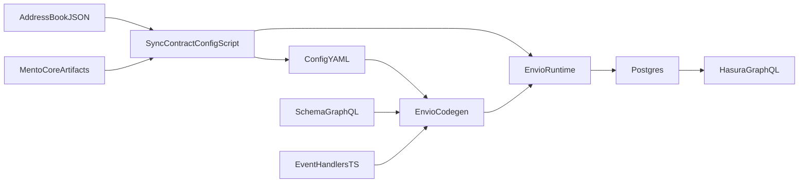

# Celo Devnet HyperIndex (v3 FPMM-focused)

This package is an Envio HyperIndex indexer for Celo devnet trading-path events.

It currently tracks:

- `FPMMFactory` (`FPMMDeployed`)
- `FPMM` (`Swap`, `Mint`, `Burn`, `UpdateReserves`, `Rebalanced`)
- `VirtualPoolFactory` (`VirtualPoolDeployed`, `PoolDeprecated`)

## How it works

The indexing flow is:

1. Address and RPC source of truth comes from `../../tools/address-book/addresses.json`.
1. `scripts/sync-contract-config.mjs` copies ABIs from `../../../mento-core/out/**` into `abis/`.
1. The same sync script generates:
   - `config/contracts.celo.v3.json` (manifest of tracked contracts/events)
   - `config.celo.devnet.yaml` (Envio runtime config)
1. `pnpm codegen` generates typed runtime code in `generated/` from:
   - `config.celo.devnet.yaml`
   - `schema.graphql`
   - `src/EventHandlers.ts`
1. `pnpm dev` starts Postgres + Hasura + indexer and writes entities from handlers into the DB.
1. You query via GraphQL at `http://localhost:8080/v1/graphql`.



## Important files

- `config.celo.devnet.yaml` — runtime chain/contracts/events config
- `schema.graphql` — entity model queried in Hasura
- `src/EventHandlers.ts` — event-to-entity mapping logic
- `scripts/sync-contract-config.mjs` — address/ABI/config sync
- `scripts/run-envio-with-env.mjs` — hardened command wrapper for env loading/validation
- `.env` — local runtime variables (`ENVIO_RPC_URL`, `ENVIO_START_BLOCK`, etc.)

## Prerequisites

- [Node.js (v18+)](https://nodejs.org/en/download/current)
- [pnpm (v8+)](https://pnpm.io/installation)
- [Docker desktop](https://www.docker.com/products/docker-desktop/)
- Access to devnet RPC (allowlist your IP from repo root with `pnpm add-ip`)

## Setup and run (Celo)

1. Copy env file:

```bash
cp .env.example .env
```

1. Prepare indexer artifacts:

```bash
pnpm prepare:indexer
```

1. Start the indexer:

```bash
pnpm dev
```

Then open `http://localhost:8080` (admin secret: `testing`).

## Commands

```bash
pnpm sync:contracts
pnpm codegen
pnpm prepare:indexer
pnpm dev
pnpm start
pnpm stop
```

Notes:

- `pnpm codegen`, `pnpm dev`, and `pnpm start` load `.env` automatically.
- `ENVIO_START_BLOCK` and `ENVIO_RPC_URL` are required for `codegen/dev/start`.
- `codegen` runs with `CI=true` internally to avoid non-TTY pnpm prompt failures.

## Query examples

Recent swaps:

```graphql
query RecentSwaps {
  SwapEvent(limit: 20, order_by: { blockNumber: desc }) {
    id
    poolId
    sender
    recipient
    amount0In
    amount1In
    amount0Out
    amount1Out
    blockNumber
    blockTimestamp
  }
}
```

Pools:

```graphql
query Pools {
  Pool(order_by: { updatedAtBlock: desc }) {
    id
    token0
    token1
    source
    createdAtBlock
    updatedAtBlock
  }
}
```

## Adding a new network

This package is currently Celo-specific (chain id and tracked contracts are curated in `scripts/sync-contract-config.mjs`).

Recommended path for a new network:

1. Duplicate this package directory (`indexers/celo` -> `indexers/<network>`).
1. Add network addresses + rpc URL in `../../tools/address-book/addresses.json`.
1. Update contract specs in `scripts/sync-contract-config.mjs`:
   - network id selection
   - contract labels
   - ABI artifact paths
   - event allowlist
1. Update `.env.example` defaults (`ENVIO_RPC_URL`, `ENVIO_START_BLOCK`).
1. Run:

```bash
pnpm sync:contracts
pnpm codegen
pnpm dev
```

1. Verify in Hasura with aggregate + known-address queries before wider use.

If we want true multi-network onboarding in one package, next step is to parameterize `sync-contract-config.mjs` with `--network <id>` and generate per-network manifests/configs.
